# Chapter 1: Between Damocles and Hydra

> "Some things benefit from shocks; they thrive and grow when exposed to volatility, randomness, disorder, and stressors."

## The Core Insight

Taleb introduces three mythological figures to represent the fundamental triad:

- **Damocles** — Sits under a sword hanging by a thread (fragile)
- **Phoenix** — Rises from ashes, returning to the same state (robust)
- **Hydra** — Grows two heads when one is cut off (antifragile)

This classification system applies to virtually everything: systems, ideas, technologies, businesses, bodies, and cultures.

## Visual: The Mythological Triad

```mermaid
flowchart TB
    subgraph Myths["Mythological Metaphors"]
        D["⚔️ DAMOCLES<br/>Sword above head<br/>One shock = death"]
        P["🔥 PHOENIX<br/>Rises from ashes<br/>Returns to baseline"]
        H["🐉 HYDRA<br/>Cut one head<br/>Two grow back"]
    end

    subgraph Property["Property"]
        F["FRAGILE<br/>Harmed by volatility"]
        R["ROBUST<br/>Indifferent to volatility"]
        A["ANTIFRAGILE<br/>Benefits from volatility"]
    end

    D --> F
    P --> R
    H --> A

    style D fill:#ffcdd2
    style P fill:#fff9c4
    style H fill:#c8e6c9
    style F fill:#ffcdd2
    style R fill:#fff9c4
    style A fill:#c8e6c9
```

## The Triad Applied

## Why This Matters

The key insight is that **antifragility is not the same as robustness**. A robust thing resists change and stays the same. An antifragile thing actually improves from the very disorders that would harm fragile things.

## Key Takeaways

1. **Beyond binary thinking** — Things aren't just "fragile" or "not fragile"—there's a spectrum
2. **Robust ≠ Antifragile** — Robustness is neutral; antifragility is positive response to stress
3. **Universal application** — The triad applies to biology, economics, technology, and life

## Think About It

- What in your life is fragile? Robust? Antifragile?
- How might you transform fragile systems into antifragile ones?
- What stressors, properly applied, could make you stronger?

## Related

- **Previous:** [Book I Overview](/chapters/book-1-antifragile-introduction/overview/)
- **Next:** [Chapter 2: Overcompensation](/chapters/book-1-antifragile-introduction/ch2-overcompensation/)
- **Concept:** [The Triad](/concepts/triad/)
