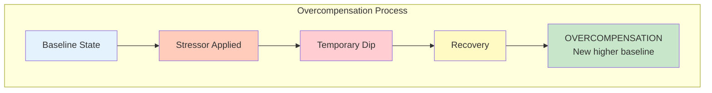
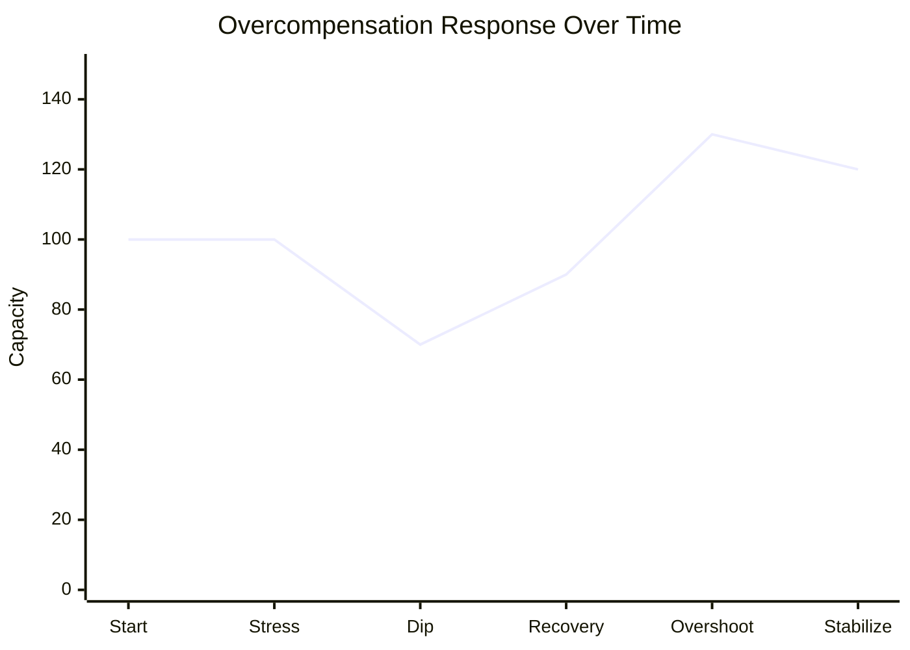
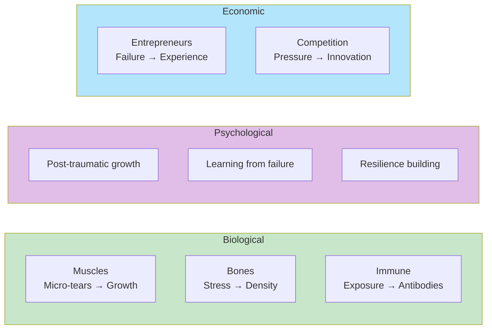
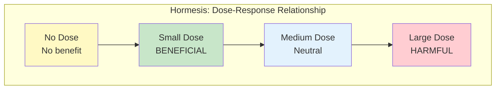
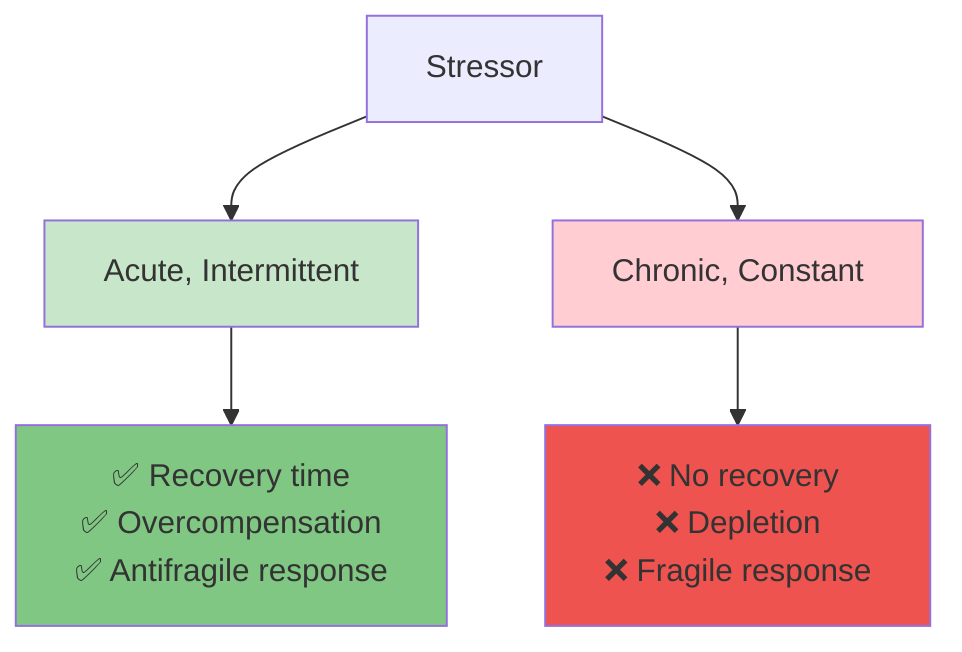
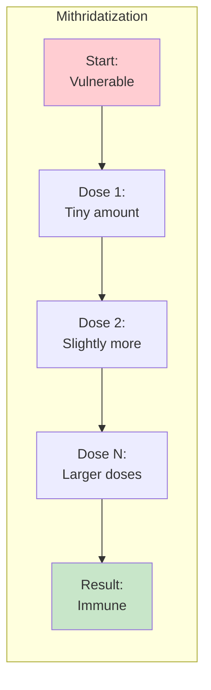

# Chapter 2: Overcompensation and Overreaction Everywhere

> "Wind extinguishes a candle and energizes fire."

## The Core Insight

Antifragility works through **overcompensation**—systems don't just recover from stress, they overshoot and become stronger than before. This is visible everywhere in nature: muscles grow stronger after being stressed, bones become denser under load, and immune systems improve after exposure to pathogens.

## Visual: The Overcompensation Mechanism

## Examples of Overcompensation

## The Hormesis Principle

**Hormesis** is the phenomenon where small doses of a harmful substance or stressor actually produce beneficial effects. It's a key mechanism of antifragility.

## Key Distinction: Good Stress vs. Bad Stress

## The Mithridatization Effect

Named after King Mithridates who built immunity to poisons by taking small doses:

## Key Takeaways

1. **Overcompensation is universal** — From muscles to organizations, stressed systems overshoot in recovery
2. **Dose matters** — Small, acute stressors benefit; chronic, overwhelming stress destroys
3. **Recovery is essential** — Without recovery time, overcompensation cannot occur
4. **Hormesis is key** — The beneficial effect of small doses of harm

## Think About It

- Where do you see overcompensation in your own life?
- Are there stressors you avoid that might actually strengthen you?
- How can you ensure adequate recovery after stress?

## Related

- **Previous:** [Chapter 1: Damocles and Hydra](/chapters/book-1-antifragile-introduction/ch1-damocles-hydra/)
- **Next:** [Chapter 3: Cat and Washing Machine](/chapters/book-1-antifragile-introduction/ch3-cat-washing-machine/)
- **Concept:** [Antifragility](/concepts/antifragility/)
