# Chapter 3: The Cat and the Washing Machine

> "The cat has survived several mass extinctions. The washing machine has survived none."

## The Core Insight

There's a fundamental distinction between **organic** (complex) systems and **mechanical** (complicated) systems. Organic systems are alive, adaptive, and potentially antifragile. Mechanical systems are designed, predictable, and at best robust.

## Visual: Organic vs Mechanical

```mermaid
flowchart TB
    subgraph Organic["🐱 ORGANIC (Complex)"]
        O1["Self-healing"]
        O2["Adaptive"]
        O3["Redundant"]
        O4["Decentralized"]
        O5["Needs stressors"]
    end

    subgraph Mechanical["🔧 MECHANICAL (Complicated)"]
        M1["Requires repair"]
        M2["Fixed response"]
        M3["Optimized"]
        M4["Centralized"]
        M5["Damaged by stressors"]
    end

    style Organic fill:#c8e6c9
    style Mechanical fill:#b3e5fc
```

## Response to Stress Comparison

## The Problem of Touristification

Taleb introduces the idea that modern life turns organic systems into mechanical ones—a process of **touristification** or **Procrustean bed** fitting:

```mermaid
flowchart TB
    subgraph Transform["Touristification"]
        Natural["Natural/Organic<br/>Variable, uncertain"]
        Modern["Modernized/Mechanical<br/>Scheduled, predictable"]
        Natural -->|"Optimization"| Modern
    end

    subgraph Examples["Examples"]
        E1["Wild adventure → Package tour"]
        E2["Artisan bread → Factory bread"]
        E3["Natural immunity → Over-sterilization"]
    end

    Modern --> L["Loss of antifragility"]

    style Natural fill:#c8e6c9
    style Modern fill:#ffcdd2
    style L fill:#ef5350
```

## Complex vs Complicated

## Why Organic Systems Need Stressors

```mermaid
flowchart TB
    Organic["Organic System"]

    Organic --> WithStress["WITH appropriate stress"]
    Organic --> WithoutStress["WITHOUT stress"]

    WithStress --> Good["✅ Maintains function<br/>✅ Builds capacity<br/>✅ Antifragile"]
    WithoutStress --> Bad["❌ Atrophies<br/>❌ Weakens<br/>❌ Becomes fragile"]

    style WithStress fill:#c8e6c9
    style WithoutStress fill:#ffcdd2
    style Good fill:#81c784
    style Bad fill:#ef5350
```

## The Bed of Procrustes

Named after the Greek myth of Procrustes who stretched or cut travelers to fit his bed:

## Key Takeaways

1. **Organic ≠ Mechanical** — Living systems have fundamentally different properties
2. **Stressors are necessary** — Organic systems need stress to maintain function
3. **Beware optimization** — Making organic systems "efficient" often makes them fragile
4. **Embrace variability** — Randomness is a feature, not a bug, for organic systems

## Think About It

- What organic aspects of your life have been "mechanized"?
- Where do you see over-optimization creating fragility?
- How can you reintroduce healthy variability into optimized systems?

## Related

- **Previous:** [Chapter 2: Overcompensation](/chapters/book-1-antifragile-introduction/ch2-overcompensation/)
- **Next:** [Chapter 4: What Kills Me](/chapters/book-1-antifragile-introduction/ch4-what-kills-me/)
- **Concept:** [Antifragility](/concepts/antifragility/)
