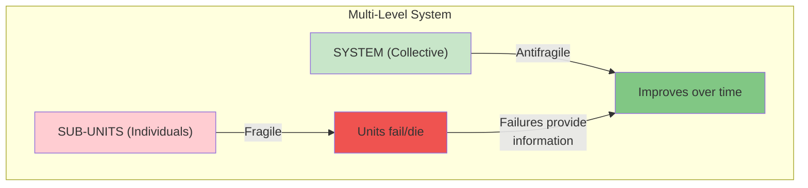
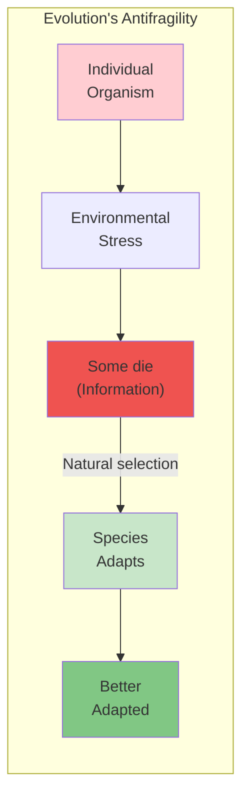
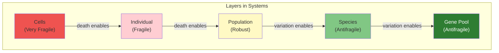
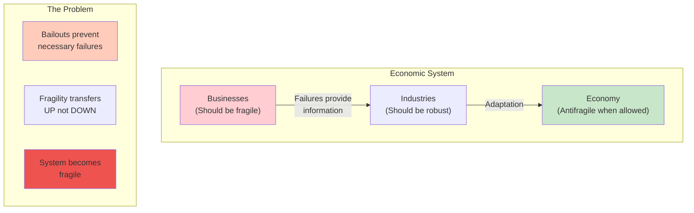
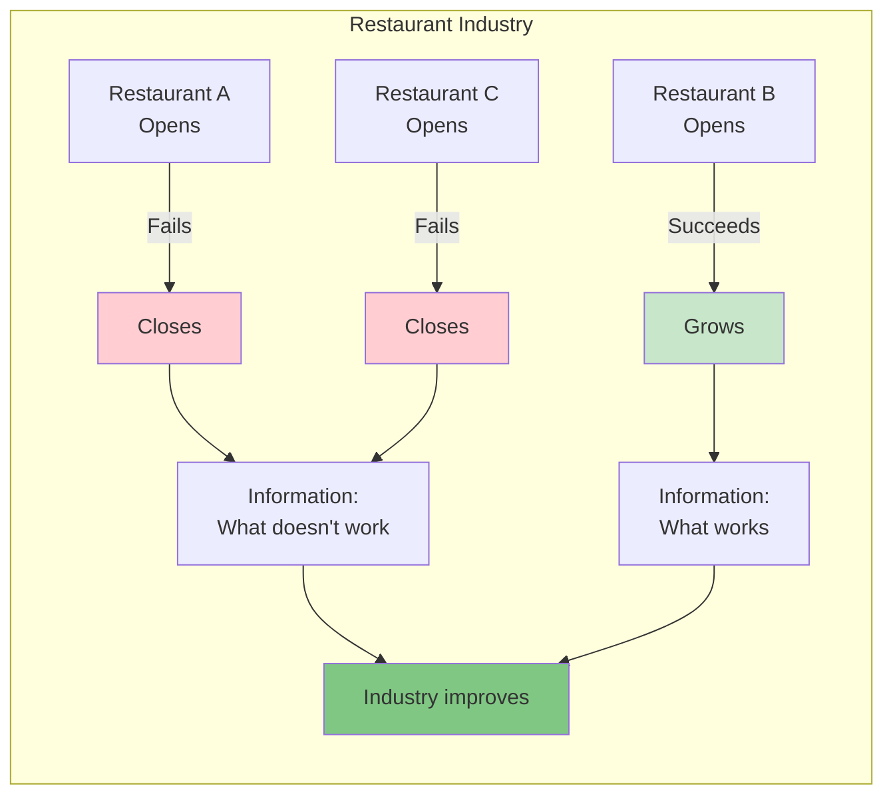
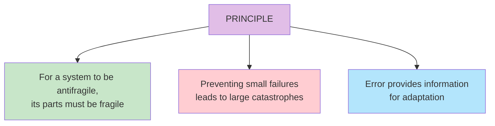

# Chapter 4: What Kills Me Makes Others Stronger

> "Nietzsche's famous maxim 'What does not kill me makes me stronger' can be improved: What kills me makes others stronger."

## The Core Insight

Antifragility at the **collective level** often requires fragility at the **individual level**. Evolution is antifragile because individual organisms are fragile—they die, but the species improves. This transfer of fragility across levels is fundamental to how complex systems become antifragile.

## Visual: Fragility Transfer Between Levels

## Evolution as the Prime Example

## Layers of Fragility

## Economic Parallels

## The Restaurant Business Example

## The Key Principle

## Key Takeaways

1. **Fragility transfers** — Individual fragility enables collective antifragility
2. **Failure is information** — Deaths, failures, and errors teach the system
3. **Preventing failures backfires** — Suppressing small failures creates big ones
4. **Skin in the game matters** — When individuals bear costs, the system learns

## Think About It

- Where do you see systems that prevent natural failures?
- How does your organization handle failure and error?
- What level of the system do you exist at? What depends on your fragility?

## Related

- **Previous:** [Chapter 3: Cat and Washing Machine](/chapters/book-1-antifragile-introduction/ch3-cat-washing-machine/)
- **Next:** [Book II Overview](/chapters/book-2-modernity/overview/)
- **Concept:** [Skin in the Game](/concepts/skin-in-the-game/)
