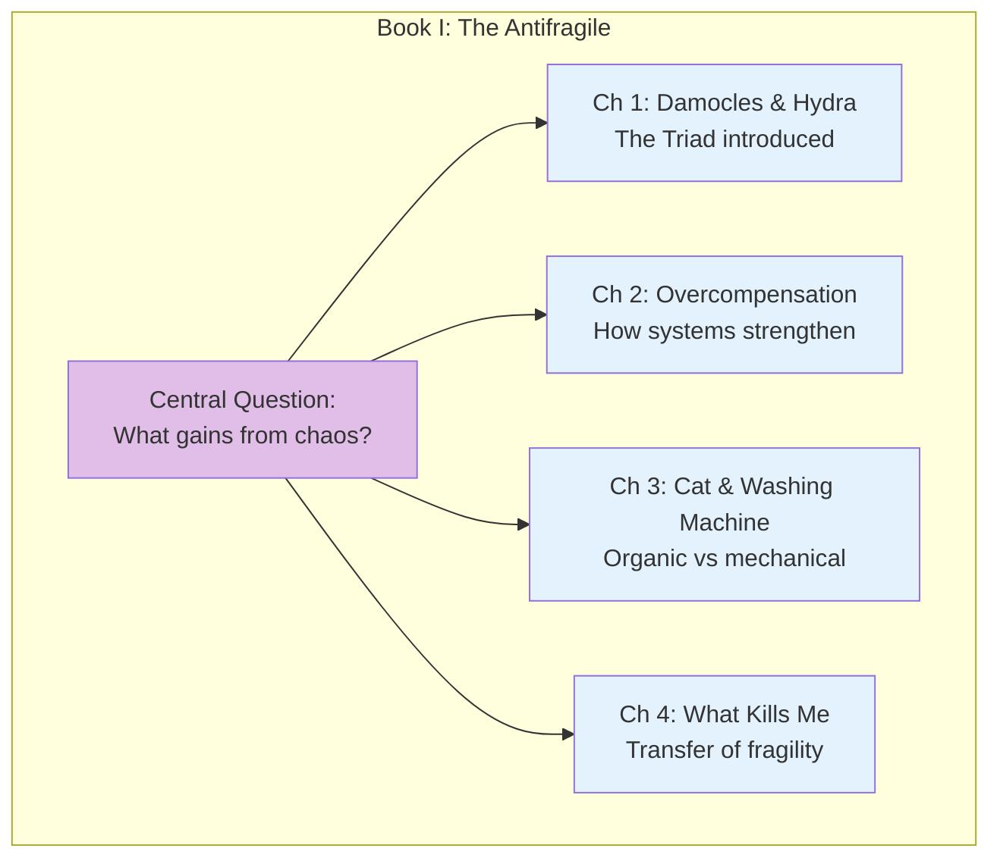
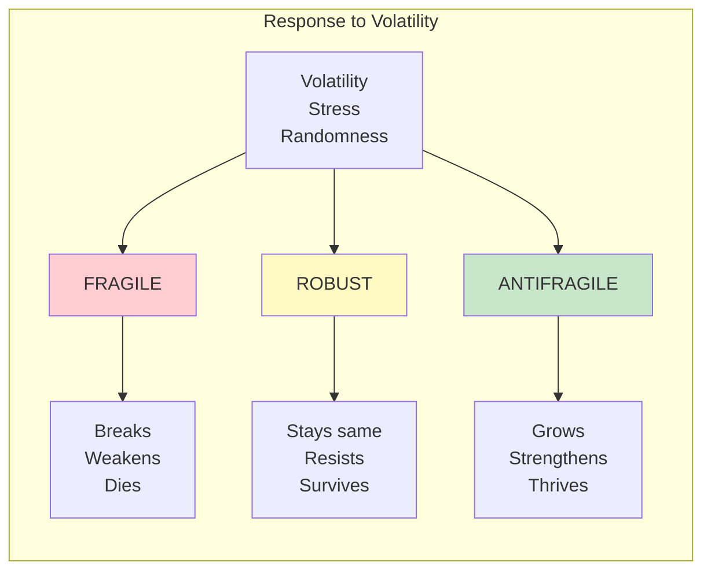

# Book I: The Antifragile - An Introduction

This opening book introduces Taleb's central concept: **antifragility**—the property of systems that gain from disorder. He establishes the fundamental triad that forms the backbone of the entire work.

## Book Overview

## Chapters in This Book

| Chapter | Title | Key Idea |
|---------|-------|----------|
| [1](/chapters/book-1-antifragile-introduction/ch1-damocles-hydra/) | Between Damocles and Hydra | The triad: fragile, robust, antifragile |
| [2](/chapters/book-1-antifragile-introduction/ch2-overcompensation/) | Overcompensation and Overreaction | How stressors make systems stronger |
| [3](/chapters/book-1-antifragile-introduction/ch3-cat-washing-machine/) | The Cat and the Washing Machine | Living systems vs mechanical systems |
| [4](/chapters/book-1-antifragile-introduction/ch4-what-kills-me/) | What Kills Me Makes Others Stronger | How fragility transfers between levels |

## Key Themes

- **The Triad** — Everything can be classified as fragile, robust, or antifragile
- **Beyond Resilience** — Antifragility is not just surviving but improving from stress
- **Organic vs Mechanical** — Living systems have fundamentally different properties
- **Layers of Fragility** — What's antifragile at one level may require fragility at another

## The Foundational Concept

## Related Concepts

- [Antifragility](/concepts/antifragility/) - The core concept explained
- [The Triad](/concepts/triad/) - Fragile, robust, antifragile classification
- [Hormesis](/concepts/antifragility/#hormesis) - Small doses of harm being beneficial

---

**Start reading:** [Chapter 1: Between Damocles and Hydra →](/chapters/book-1-antifragile-introduction/ch1-damocles-hydra/)
