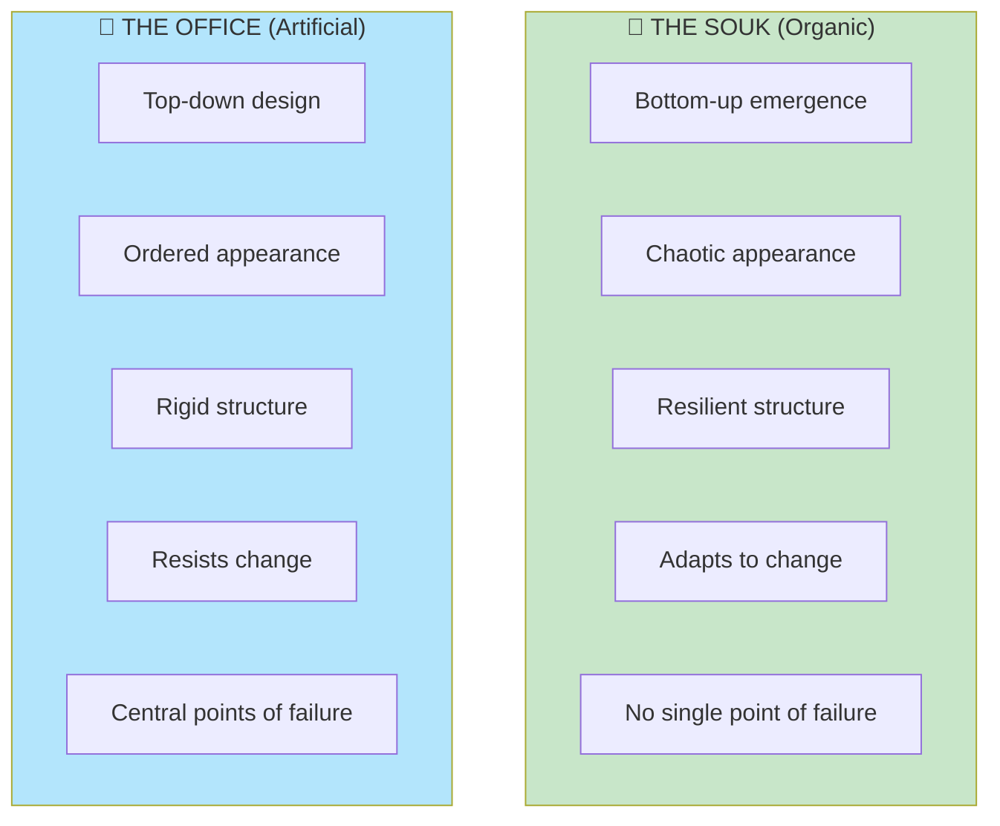
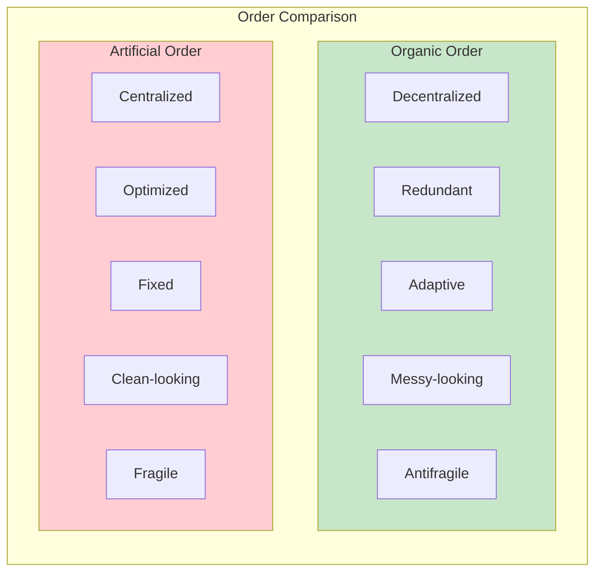
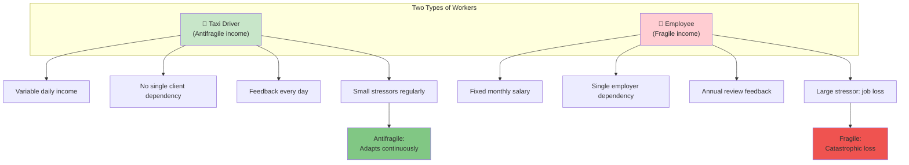
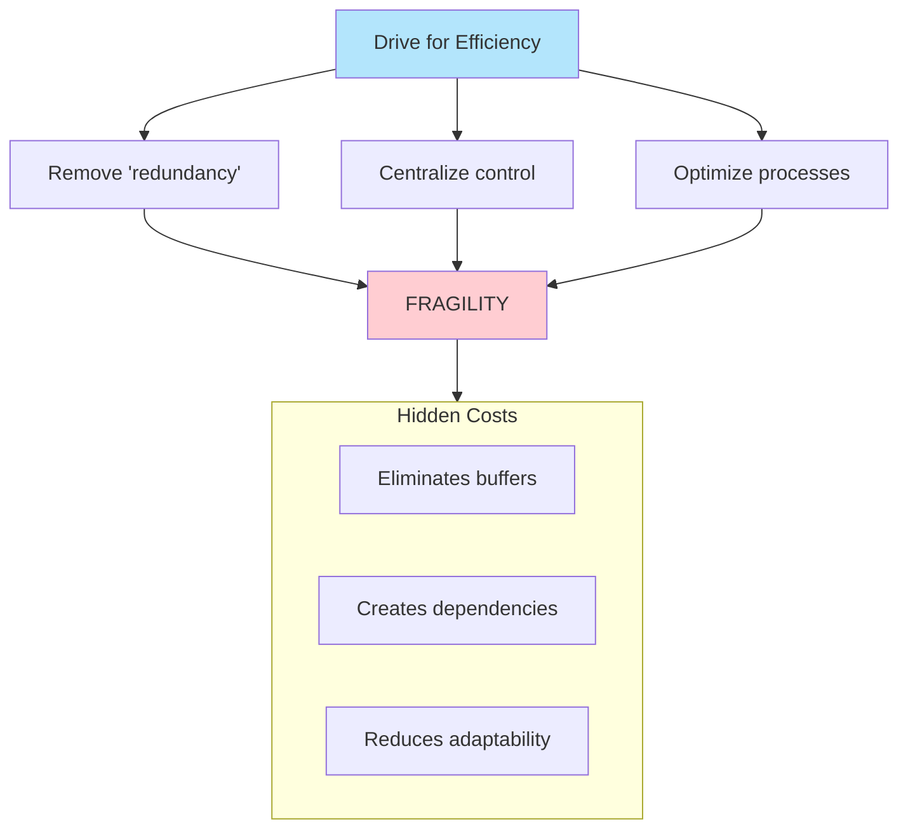

# Chapter 5: The Souk and the Office Building

> "The difference between a chaotic city like Aleppo (before the war) and a sterile one like Las Vegas."

## The Core Insight

There are two types of order: **organic order** that emerges from the bottom up (like a traditional souk/bazaar) and **artificial order** imposed from the top down (like a modern office building). Organic order is antifragile; artificial order is fragile.

## Visual: Two Types of Order

## Characteristics Comparison

## The Taxi Driver vs The Employee

## The Problem with "Efficiency"

## Key Takeaways

1. **Mess can be strength** — Organic disorder often hides robust structure
2. **Beware of neat solutions** — Clean, optimized systems are often fragile
3. **Variability is information** — Regular small fluctuations enable adaptation
4. **Decentralization protects** — No single point of failure

## Think About It

- Is your income more like a taxi driver's or an employee's?
- What "inefficiencies" in your life might actually be protective?
- How could you introduce healthy variability into stable systems?

## Related

- **Previous:** [Book II Overview](/chapters/book-2-modernity/overview/)
- **Next:** [Chapter 6: I Love Randomness](/chapters/book-2-modernity/ch6-love-randomness/)
- **Concept:** [Barbell Strategy](/concepts/barbell-strategy/)
