# Chapter 6: Tell Them I Love (Some) Randomness

> "Randomness is not always bad. The trick is to be in a position to benefit from it."

## The Core Insight

Not all randomness is bad. In fact, **some randomness is necessary** for antifragile systems to function properly. The key is distinguishing between destructive randomness and beneficial variability.

## Visual: Good Randomness vs Bad Randomness

```mermaid
flowchart TB
    Randomness["RANDOMNESS"]

    Randomness --> Good["✅ GOOD Randomness"]
    Randomness --> Bad["❌ BAD Randomness"]

    Good --> G1["Small, frequent shocks"]
    Good --> G2["Provides information"]
    Good --> G3["Allows adaptation"]
    Good --> G4["Builds strength"]

    Bad --> B1["Large, rare catastrophes"]
    Bad --> B2["Overwhelming"]
    Bad --> B3["No recovery time"]
    Bad --> B4["Destroys"]

    style Good fill:#c8e6c9
    style Bad fill:#ffcdd2
```

## The Benefits of Variability

```mermaid
flowchart LR
    subgraph Benefits["Why Variability Helps"]
        V["Natural<br/>Variability"]

        V --> B1["🎯 Reveals information<br/>about system state"]
        V --> B2["💪 Triggers<br/>adaptation response"]
        V --> B3["🛡️ Builds reserves<br/>for large events"]
        V --> B4["📊 Creates<br/>optionality"]
    end

    style V fill:#e1bee7
    style B1 fill:#c8e6c9
    style B2 fill:#c8e6c9
    style B3 fill:#c8e6c9
    style B4 fill:#c8e6c9
```

## Suppressing Randomness Creates Fragility

## Forest Fire Analogy

```mermaid
flowchart TB
    subgraph Forest["Forest Fire Management"]
        direction LR

        subgraph Allow["Allow Small Fires"]
            A1["🔥 Small fires<br/>burn naturally"]
            A2["🌲 Clear underbrush"]
            A3["✅ Forest remains<br/>healthy"]
        end

        subgraph Suppress["Suppress All Fires"]
            S1["🚫 All fires<br/>extinguished"]
            S2["📈 Fuel builds up"]
            S3["💥 Catastrophic<br/>mega-fire"]
        end
    end

    style Allow fill:#c8e6c9
    style Suppress fill:#ffcdd2
    style S3 fill:#ef5350
```

## Application: Financial Markets

## Key Takeaways

1. **Randomness is information** — Variability tells you about system health
2. **Suppression backfires** — Eliminating small shocks leads to large ones
3. **Position matters** — The key is being structured to benefit from randomness
4. **Embrace volatility** — Some turbulence is healthy and necessary

## Think About It

- What randomness in your life have you tried to eliminate?
- Where might suppressing variability be building hidden fragility?
- How can you position yourself to benefit from randomness?

## Related

- **Previous:** [Chapter 5: Souk and Office](/chapters/book-2-modernity/ch5-souk-office/)
- **Next:** [Chapter 7: Naive Intervention](/chapters/book-2-modernity/ch7-naive-intervention/)
- **Concept:** [Optionality](/concepts/optionality/)
