# Chapter 7: Naive Intervention

> "We should not be naive about the iatrogenics of intervention."

## The Core Insight

**Iatrogenics** is harm caused by the healer. Originally a medical term, Taleb expands it to cover all domains where intervention causes more harm than good. **Naive intervention** is acting to "fix" things without understanding the full consequences.

## Visual: The Iatrogenics Concept

## When Intervention Helps vs Harms

```mermaid
flowchart TB
    Condition["Condition"]

    Condition --> Severe["SEVERE<br/>(Clear threat)"]
    Condition --> Mild["MILD<br/>(Uncertain threat)"]

    Severe --> S_Int["Intervention"]
    Mild --> M_Int["Intervention"]

    S_Int --> S_Result["✅ Benefit > Risk<br/>Intervention helps"]
    M_Int --> M_Result["❌ Risk > Benefit<br/>Intervention harms"]

    style Severe fill:#ffcdd2
    style Mild fill:#fff9c4
    style S_Result fill:#c8e6c9
    style M_Result fill:#ffcdd2
```

## The Mother vs Doctor Example

```mermaid
flowchart LR
    subgraph Medical["Medical Intervention History"]
        direction TB

        subgraph Past["Past: Excessive Intervention"]
            P1["Fever? → Bleed patient"]
            P2["Illness? → Mercury treatment"]
            P3["Result: Shortened lives"]
        end

        subgraph Mother["Mother's Approach"]
            M1["Fever? → Rest and fluids"]
            M2["Illness? → Chicken soup"]
            M3["Result: Body heals itself"]
        end
    end

    style Past fill:#ffcdd2
    style Mother fill:#c8e6c9
```

## The First Do No Harm Principle

## Domains of Naive Intervention

```mermaid
flowchart TB
    NI["Naive Intervention"]

    NI --> Med["🏥 Medicine<br/>Over-treatment"]
    NI --> Econ["💰 Economy<br/>Over-regulation"]
    NI --> Parent["👨‍👩‍👧 Parenting<br/>Helicopter parents"]
    NI --> Policy["🏛️ Policy<br/>Unintended consequences"]

    Med --> MR["Antibiotic resistance,<br/>weakened immune systems"]
    Econ --> ER["Moral hazard,<br/>market distortions"]
    Parent --> PR["Fragile children,<br/>anxiety"]
    Policy --> PoR["Perverse incentives,<br/>dependency"]

    style NI fill:#e1bee7
    style MR fill:#ffcdd2
    style ER fill:#ffcdd2
    style PR fill:#ffcdd2
    style PoR fill:#ffcdd2
```

## The Burden of Proof

## Key Takeaways

1. **First, do no harm** — Intervention must clear a high bar
2. **Severity matters** — The sicker the patient, the more intervention is justified
3. **Hidden costs** — Interventions often have invisible second-order effects
4. **Nature knows more** — Evolution has solved many problems; respect that

## Think About It

- Where in your life do you intervene too much?
- What problems might solve themselves if left alone?
- What are the hidden costs of your interventions?

## Related

- **Previous:** [Chapter 6: I Love Randomness](/chapters/book-2-modernity/ch6-love-randomness/)
- **Next:** [Chapter 8: Prediction](/chapters/book-2-modernity/ch8-prediction/)
- **Concept:** [Iatrogenics](/concepts/iatrogenics/)
