# Chapter 8: Prediction as a Child of Modernity

> "Prediction, not narration, is the real test of our understanding of the world."

## The Core Insight

Modern society is obsessed with **prediction**—forecasting the future to control it. But complex systems are fundamentally unpredictable. The solution isn't better predictions but **positioning yourself to not need predictions**.

## Visual: The Prediction Problem

## Why Prediction Fails in Complex Systems

## The Turkey Problem

```mermaid
flowchart LR
    subgraph Turkey["The Turkey Problem"]
        direction TB
        D1["Day 1: Fed ✅"]
        D2["Day 2: Fed ✅"]
        D3["Day 100: Fed ✅"]
        D4["Day 1000: Fed ✅"]
        DT["Thanksgiving: 🔪"]

        D1 --> D2 --> D3 --> D4 --> DT
    end

    subgraph Lesson["Lesson"]
        L1["Past data doesn't<br/>predict rare events"]
        L2["Confidence increases<br/>until disaster"]
    end

    DT --> Lesson

    style DT fill:#ef5350,color:white
```

## Prediction vs Preparation

## The Alternative: Optionality

## Experts and Prediction

```mermaid
flowchart TB
    subgraph Experts["Expert Prediction Track Record"]
        E["'Expert' Forecasts"]

        E --> Econ["Economists<br/>❌ Missed 2008 crisis"]
        E --> Political["Political analysts<br/>❌ Missed USSR collapse"]
        E --> Tech["Tech experts<br/>❌ Missed internet scale"]
    end

    subgraph Why["Why Experts Fail"]
        W1["Overconfident"]
        W2["Linear thinking"]
        W3["Ignore tail risks"]
        W4["No skin in game"]
    end

    style E fill:#b3e5fc
    style Econ fill:#ffcdd2
    style Political fill:#ffcdd2
    style Tech fill:#ffcdd2
```

## Key Takeaways

1. **Prediction is futile** — Complex systems can't be accurately forecast
2. **Preparation beats prediction** — Build robustness instead
3. **Optionality is key** — Structure to benefit from any outcome
4. **Beware experts** — Track record on major events is poor

## Think About It

- What predictions are you relying on?
- How can you reduce your dependence on forecasts?
- What would optionality look like in your situation?

## Related

- **Previous:** [Chapter 7: Naive Intervention](/chapters/book-2-modernity/ch7-naive-intervention/)
- **Next:** [Book III Overview](/chapters/book-3-nonpredictive/overview/)
- **Concept:** [Optionality](/concepts/optionality/)
