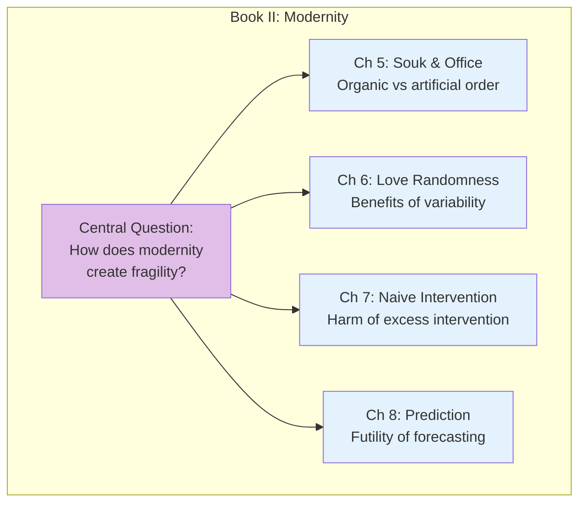
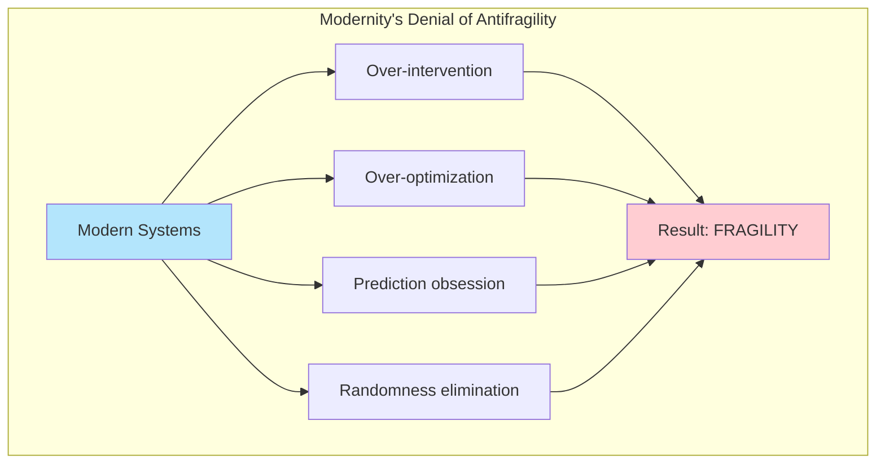

# Book II: Modernity and the Denial of Antifragility

This book explores how modern society systematically suppresses antifragility through excessive intervention, over-optimization, and the denial of randomness.

## Book Overview

## Chapters in This Book

| Chapter | Title | Key Idea |
|---------|-------|----------|
| [5](/chapters/book-2-modernity/ch5-souk-office/) | The Souk and the Office Building | Bottom-up vs top-down order |
| [6](/chapters/book-2-modernity/ch6-love-randomness/) | Tell Them I Love (Some) Randomness | The benefits of variability |
| [7](/chapters/book-2-modernity/ch7-naive-intervention/) | Naive Intervention | The harm of trying to help |
| [8](/chapters/book-2-modernity/ch8-prediction/) | Prediction as a Child of Modernity | Why forecasting fails |

## Key Themes

- **Bottom-up Order** — Organic order emerges; artificial order is imposed
- **Randomness Denial** — Modernity tries to eliminate all variability
- **Iatrogenics** — Harm caused by the healer/helper
- **Prediction Fallacy** — The impossibility of accurate forecasting

## The Modern Problem

## Related Concepts

- [Iatrogenics](/concepts/iatrogenics/) - Harm done by healers
- [Via Negativa](/concepts/via-negativa/) - The power of subtraction

---

**Start reading:** [Chapter 5: The Souk and the Office Building →](/chapters/book-2-modernity/ch5-souk-office/)
