# Chapter 10: Seneca's Upside and Downside

> "Seneca was the wealthiest person in the Roman Empire... yet he practiced poverty."

## The Core Insight

The Stoic philosopher **Seneca** was extraordinarily wealthy, yet he regularly practiced living with nothing. This wasn't contradiction—it was **asymmetric wisdom**: enjoy the upside of wealth while being mentally prepared for its loss. This removes fragility.

## Visual: Seneca's Approach

## The Asymmetry Principle

## Stoic Risk Management

```mermaid
flowchart TB
    subgraph Stoic["Stoic Approach to Fortune"]
        Fortune["Fortune (Good or Bad)"]

        Fortune --> Good["Good Fortune"]
        Fortune --> Bad["Bad Fortune"]

        Good --> GR["Enjoy it—but don't<br/>become dependent"]
        Bad --> BR["Accept it—you were<br/>already prepared"]

        GR --> Result["EQUANIMITY"]
        BR --> Result
    end

    style Result fill:#c8e6c9
```

## Premeditation of Adversity

## Practical Applications

```mermaid
flowchart TB
    subgraph Applications["Apply Seneca's Wisdom"]
        A1["💰 Finance<br/>Have wealth, don't<br/>need wealth"]
        A2["🏠 Possessions<br/>Enjoy things, not<br/>attached to things"]
        A3["👔 Career<br/>Have job, could<br/>lose job tomorrow"]
        A4["❤️ Relationships<br/>Love people, accept<br/>impermanence"]
    end

    A1 --> Result["Antifragile<br/>Mindset"]
    A2 --> Result
    A3 --> Result
    A4 --> Result

    style Result fill:#c8e6c9
```

## The Wealthy vs The Rich

## Key Takeaways

1. **Enjoy without depending** — Use fortune without needing it
2. **Practice adversity** — Regularly experience what you fear
3. **Asymmetric positioning** — Limit downside, keep upside open
4. **Mental preparation** — Remove the power of worst-case scenarios

## Think About It

- What would you do if you lost everything tomorrow?
- How can you practice "poverty" in your own life?
- Where are you too dependent on things you could lose?

## Related

- **Previous:** [Chapter 9: Fat Tony](/chapters/book-3-nonpredictive/ch9-fat-tony/)
- **Next:** [Chapter 11: Rock Star](/chapters/book-3-nonpredictive/ch11-rock-star/)
- **Concept:** [Barbell Strategy](/concepts/barbell-strategy/)
