# Chapter 11: Never Marry the Rock Star

> "Avoid dependence on a single source of anything."

## The Core Insight

Marrying a rock star seems attractive—upside looks huge. But you become completely dependent on one volatile source. This is the **fragility of concentration**: putting all eggs in one basket, especially a volatile one.

## Visual: The Rock Star Problem

## Concentration vs Diversification

## Types of Fragile Dependencies

```mermaid
flowchart TB
    Dependencies["FRAGILE DEPENDENCIES"]

    Dependencies --> Career["💼 Career<br/>One employer"]
    Dependencies --> Business["🏢 Business<br/>One big client"]
    Dependencies --> Location["📍 Location<br/>One market"]
    Dependencies --> Skill["🛠️ Skill<br/>One expertise"]

    Career --> Risk["Risk: Layoff = ruin"]
    Business --> Risk
    Location --> Risk
    Skill --> Risk

    style Dependencies fill:#e1bee7
    style Risk fill:#ffcdd2
```

## The Alternative: Redundancy

## Identifying Your Dependencies

## Key Takeaways

1. **Concentration is fragility** — Single dependencies are dangerous
2. **Redundancy is strength** — Multiple sources protect you
3. **Volatile sources amplify risk** — High upside often means high downside
4. **Build before you need** — Create alternatives when times are good

## Think About It

- What are your "rock stars"—single dependencies?
- What would happen if your main income source disappeared?
- How can you build redundancy into your life?

## Related

- **Previous:** [Chapter 10: Seneca](/chapters/book-3-nonpredictive/ch10-seneca/)
- **Next:** [Book IV Overview](/chapters/book-4-optionality/overview/)
- **Concept:** [Barbell Strategy](/concepts/barbell-strategy/)
