# Chapter 9: Fat Tony and the Fragilistas

> "Fat Tony has an attribute: he doesn't believe in explanations."

## The Core Insight

Taleb introduces **Fat Tony**, a Brooklyn character who represents practical wisdom—the ability to thrive through street smarts rather than academic knowledge. His opposite is the **Fragilista**: someone who applies fragile theoretical frameworks to complex situations.

## Visual: Fat Tony vs Dr. John

```mermaid
flowchart TB
    subgraph Characters["Two Types of Knowledge"]
        subgraph Tony["🏋️ FAT TONY"]
            T1["Practical wisdom"]
            T2["Skin in the game"]
            T3["Skeptical of models"]
            T4["Nonlinear thinking"]
            T5["Heuristics-based"]
        end

        subgraph John["🎓 DR. JOHN (Fragilista)"]
            J1["Academic knowledge"]
            J2["No skin in game"]
            J3["Believes in models"]
            J4["Linear thinking"]
            J5["Theory-based"]
        end
    end

    style Tony fill:#c8e6c9
    style John fill:#ffcdd2
```

## The Coin Flip Problem

```mermaid
flowchart TB
    subgraph Problem["The Problem"]
        Q["A fair coin has landed heads<br/>99 times in a row.<br/>What's the probability of<br/>heads next flip?"]
    end

    subgraph Answers["Two Answers"]
        John["DR. JOHN says:<br/>'50%—coins have<br/>no memory'"]
        Tony["FAT TONY says:<br/>'Less than 1%—this<br/>coin is loaded!'"]
    end

    Q --> John
    Q --> Tony

    John --> JR["Textbook correct,<br/>practically wrong"]
    Tony --> TR["Textbook wrong,<br/>practically right"]

    style John fill:#ffcdd2
    style Tony fill:#c8e6c9
    style JR fill:#ef5350
    style TR fill:#81c784
```

## Fragilista Characteristics

## Fat Tony's Wisdom

## Knowledge Types

## Key Takeaways

1. **Practical wisdom matters** — Street smarts often beat book smarts
2. **Models aren't reality** — The map is not the territory
3. **Skin in the game filters** — Trust those with something to lose
4. **Context matters** — Abstract answers can be practically wrong

## Think About It

- Are you more like Fat Tony or Dr. John?
- Whose advice do you follow—those with or without skin in the game?
- What practical wisdom have you learned that can't be taught in books?

## Related

- **Previous:** [Book III Overview](/chapters/book-3-nonpredictive/overview/)
- **Next:** [Chapter 10: Seneca](/chapters/book-3-nonpredictive/ch10-seneca/)
- **Concept:** [Skin in the Game](/concepts/skin-in-the-game/)
