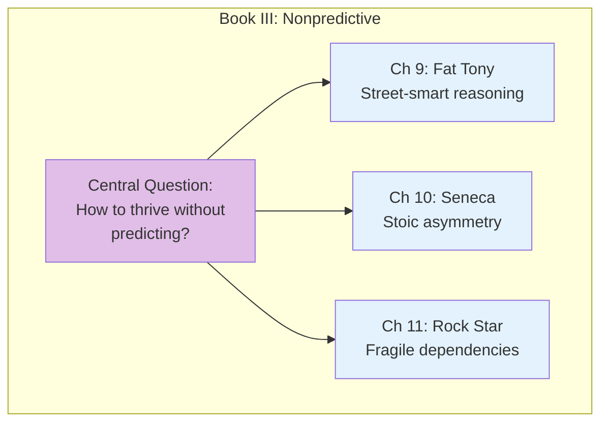
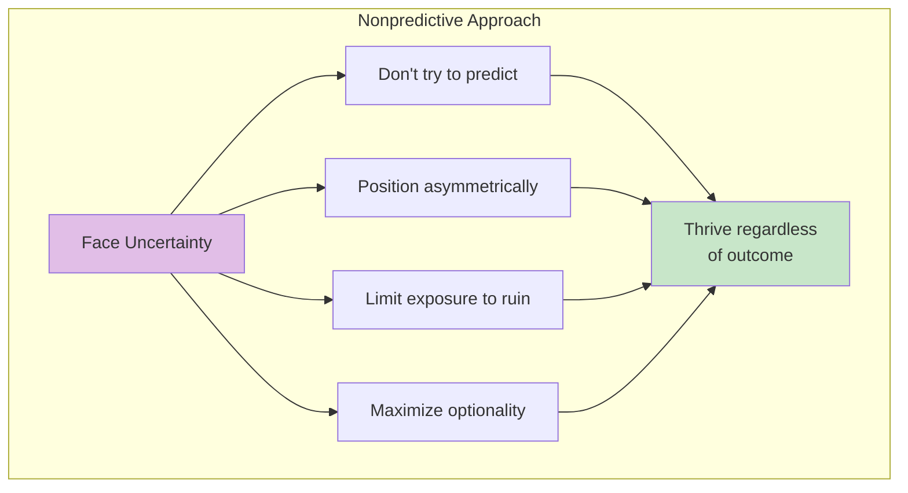

# Book III: A Nonpredictive View of the World

This book introduces practical wisdom for thriving in uncertainty—drawing from Stoic philosophy, the character of Fat Tony, and the asymmetry of Seneca's approach.

## Book Overview

## Chapters in This Book

| Chapter | Title | Key Idea |
|---------|-------|----------|
| [9](/chapters/book-3-nonpredictive/ch9-fat-tony/) | Fat Tony and the Fragilistas | Street wisdom vs academic knowledge |
| [10](/chapters/book-3-nonpredictive/ch10-seneca/) | Seneca's Upside and Downside | Stoic approach to asymmetric risk |
| [11](/chapters/book-3-nonpredictive/ch11-rock-star/) | Never Marry the Rock Star | Avoiding fragile dependencies |

## Key Themes

- **Practical Wisdom** — Real-world reasoning vs theoretical knowledge
- **Asymmetric Positioning** — Limiting downside, expanding upside
- **Stoic Philosophy** — Ancient wisdom for modern uncertainty
- **Dependency Risks** — The dangers of concentrated bets

## The Nonpredictive Approach

## Related Concepts

- [Optionality](/concepts/optionality/) - Asymmetric positioning
- [Barbell Strategy](/concepts/barbell-strategy/) - Extreme risk management
- [Skin in the Game](/concepts/skin-in-the-game/) - Accountability in uncertainty

---

**Start reading:** [Chapter 9: Fat Tony and the Fragilistas →](/chapters/book-3-nonpredictive/ch9-fat-tony/)
