# Chapter 12: Thales' Sweet Grapes

> "An option is a contract that gives its owner the right but not the obligation to do something."

## The Core Insight

The philosopher **Thales** demonstrated optionality by purchasing options on olive presses. He paid a small amount for the right (not obligation) to rent presses at a fixed price. Good harvest? He exercised and profited. Bad harvest? He lost only the small fee. This is **rational speculation through optionality**.

## Visual: Thales' Strategy

```mermaid
flowchart TB
    subgraph Thales["Thales' Option"]
        Buy["Pays small fee for<br/>OPTION on olive presses"]

        Buy --> Good["Good Harvest"]
        Buy --> Bad["Bad Harvest"]

        Good --> Exercise["Exercises option<br/>Huge profits! 💰"]
        Bad --> Walk["Walks away<br/>Loses only fee"]
    end

    style Buy fill:#b3e5fc
    style Good fill:#c8e6c9
    style Bad fill:#ffcdd2
    style Exercise fill:#81c784
    style Walk fill:#fff9c4
```

## The Option Payoff Structure

## Types of Options in Life

```mermaid
flowchart TB
    Options["OPTIONS IN LIFE"]

    Options --> Financial["💰 Financial<br/>Stock options,<br/>insurance"]
    Options --> Career["💼 Career<br/>Skills that open doors"]
    Options --> Social["🤝 Social<br/>Network = options"]
    Options --> Knowledge["📚 Knowledge<br/>Learning = options"]

    Financial --> Principle["All create<br/>asymmetric exposure"]
    Career --> Principle
    Social --> Principle
    Knowledge --> Principle

    style Options fill:#e1bee7
    style Principle fill:#c8e6c9
```

## Option vs Non-Option Position

## The Barbell and Optionality

## Key Takeaways

1. **Options = antifragility** — Asymmetric exposure benefits from uncertainty
2. **Small costs, large benefits** — The defining feature of options
3. **Walk-away power** — Options give you the right, not obligation
4. **Options are everywhere** — Not just financial; apply to all domains

## Think About It

- What options do you currently hold in your life?
- What small investments could give you large potential upside?
- Where are you committed when you could have optionality?

## Related

- **Previous:** [Book IV Overview](/chapters/book-4-optionality/overview/)
- **Next:** [Chapter 13: Lecturing Birds](/chapters/book-4-optionality/ch13-lecturing-birds/)
- **Concept:** [Optionality](/concepts/optionality/)
