# Chapter 13: Lecturing Birds on How to Fly

> "We think that we invented mathematics, but mathematics was there before us."

## The Core Insight

There's a common **narrative** that academic theory drives practical innovation. In reality, it's often the reverse: practitioners tinker and discover, then academics come later to explain and formalize. It's like lecturing birds on aerodynamics after they've been flying for millions of years.

## Visual: The Narrative Reversal

## Examples of Practice Before Theory

```mermaid
flowchart TB
    subgraph Examples["Practice Preceded Theory"]
        Flight["✈️ FLIGHT<br/>Wright Brothers<br/>flew before<br/>aerodynamics theory"]

        Steam["🚂 STEAM ENGINE<br/>Worked for 100 years<br/>before thermodynamics<br/>was understood"]

        Medicine["💊 MEDICINE<br/>Aspirin used for<br/>decades before<br/>mechanism known"]

        Architecture["🏛️ ARCHITECTURE<br/>Cathedrals built<br/>without structural<br/>engineering theory"]
    end

    style Flight fill:#c8e6c9
    style Steam fill:#c8e6c9
    style Medicine fill:#c8e6c9
    style Architecture fill:#c8e6c9
```

## The Tinkering Process

## The Soviet-Harvard Fallacy

## Why Tinkering Works

## Key Takeaways

1. **Practice often precedes theory** — Don't wait for complete understanding
2. **Tinkering is powerful** — Trial and error discovers what theory can't
3. **Beware expert narratives** — They often reverse cause and effect
4. **Action over analysis** — Start doing, learn by doing

## Think About It

- Where are you waiting for theory before you act?
- What could you learn by tinkering that no book could teach?
- What "expert" narratives might have causation reversed?

## Related

- **Previous:** [Chapter 12: Thales' Grapes](/chapters/book-4-optionality/ch12-thales-grapes/)
- **Next:** [Chapter 14: Not Same Thing](/chapters/book-4-optionality/ch14-not-same-thing/)
- **Concept:** [Optionality](/concepts/optionality/)
