# Chapter 14: When Two Things Are Not the Same Thing

> "The green lumber fallacy: confusing knowledge about a product's price behavior with knowledge about the product itself."

## The Core Insight

A successful lumber trader thought "green lumber" meant painted green, when it actually means freshly cut. His ignorance of this "basic" fact didn't matter—he understood price behavior. This is the **green lumber fallacy**: confusing different types of knowledge, and assuming academic knowledge translates to practical success.

## Visual: The Green Lumber Fallacy

```mermaid
flowchart TB
    subgraph Fallacy["THE GREEN LUMBER FALLACY"]
        Trader["Successful Lumber Trader"]

        Trader --> Know["KNEW:<br/>Price movements,<br/>market behavior,<br/>how to trade"]
        Trader --> NotKnow["DIDN'T KNOW:<br/>'Green lumber' means<br/>freshly cut, not painted"]

        Know --> Success["Made millions 💰"]
        NotKnow --> NoMatter["Didn't matter!"]
    end

    style Know fill:#c8e6c9
    style NotKnow fill:#ffcdd2
    style Success fill:#81c784
    style NoMatter fill:#fff9c4
```

## Two Types of Knowledge

## The Inverse Knowledge Problem

## Examples of the Fallacy

```mermaid
flowchart TB
    Examples["GREEN LUMBER EXAMPLES"]

    Examples --> E1["📊 Finance<br/>PhDs often worse<br/>traders than practitioners"]
    Examples --> E2["👨‍🍳 Cooking<br/>Great chefs without<br/>food science degrees"]
    Examples --> E3["🏃 Sports<br/>Athletes don't need<br/>biomechanics PhDs"]
    Examples --> E4["🏛️ Startups<br/>MBAs often fail more<br/>than dropouts"]

    style Examples fill:#e1bee7
    style E1 fill:#c8e6c9
    style E2 fill:#c8e6c9
    style E3 fill:#c8e6c9
    style E4 fill:#c8e6c9
```

## What Knowledge Actually Matters

## Key Takeaways

1. **Don't confuse knowledge types** — Knowing about ≠ knowing how
2. **Practical knowledge wins** — Results matter more than understanding
3. **Beware credentials** — Degrees don't guarantee practical skill
4. **Focus on what matters** — Learn what drives outcomes

## Think About It

- What "basic" knowledge might be irrelevant to your goals?
- Where do you confuse theoretical and practical knowledge?
- What heuristics work for you without fully understanding why?

## Related

- **Previous:** [Chapter 13: Lecturing Birds](/chapters/book-4-optionality/ch13-lecturing-birds/)
- **Next:** [Chapter 15: History Losers](/chapters/book-4-optionality/ch15-history-losers/)
- **Concept:** [Skin in the Game](/concepts/skin-in-the-game/)
