# Chapter 15: History Written by the Losers

> "The narrative fallacy gives us a false chronicle of the true causes of events."

## The Core Insight

History is often written by those who **theorize** rather than those who **do**. Academics and writers get credit for explaining innovation, while the tinkerers and practitioners who actually created it are forgotten. In this sense, history is "written by the losers"—the explainers, not the doers.

## Visual: Who Gets Credit vs Who Creates

## The Narrative Fallacy

## Examples of Misattributed Progress

```mermaid
flowchart TB
    Examples["MISATTRIBUTED CREDIT"]

    Examples --> Med["🏥 Medicine<br/>Progress = practitioners<br/>Credit = researchers"]
    Examples --> Tech["💻 Technology<br/>Progress = tinkerers<br/>Credit = theorists"]
    Examples --> Bus["📈 Business<br/>Progress = entrepreneurs<br/>Credit = MBA professors"]
    Examples --> Arch["🏛️ Architecture<br/>Progress = builders<br/>Credit = architects"]

    style Examples fill:#e1bee7
```

## The Epiphenomenon Problem

## Why This Matters

## Key Takeaways

1. **Doers vs explainers** — Those who create often aren't those who get credit
2. **Narrative fallacy** — Good stories trump accurate history
3. **Practice drives progress** — Theory usually follows, not leads
4. **Value practitioners** — The real heroes are often forgotten

## Think About It

- What innovations do you attribute to theorists that came from practitioners?
- Are you focused on doing or explaining?
- Whose work are you building on that history has forgotten?

## Related

- **Previous:** [Chapter 14: Not Same Thing](/chapters/book-4-optionality/ch14-not-same-thing/)
- **Next:** [Book V Overview](/chapters/book-5-nonlinear/overview/)
- **Concept:** [Skin in the Game](/concepts/skin-in-the-game/)
