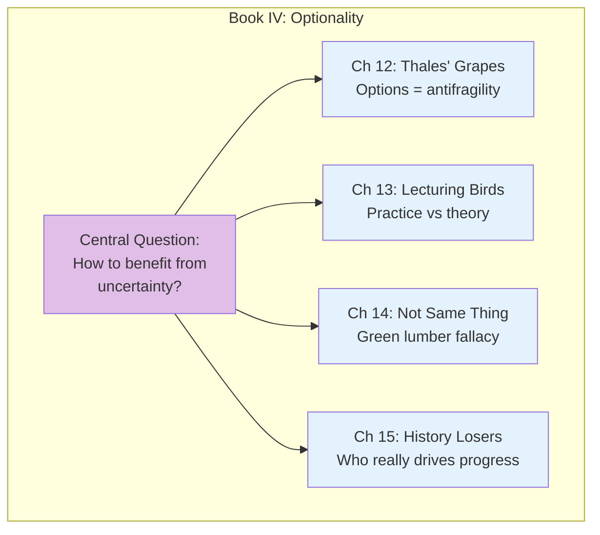
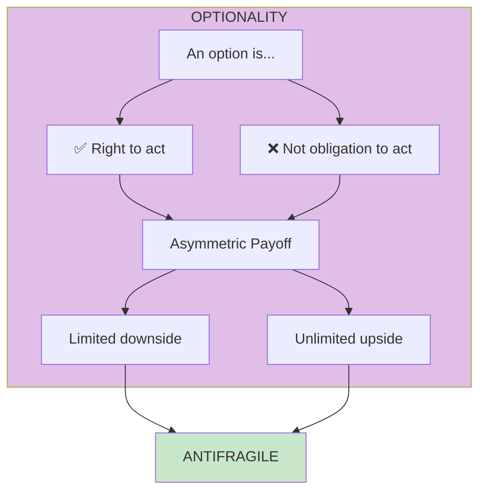

# Book IV: Optionality, Technology, and the Intelligence of Antifragility

This book explores **optionality**—the asymmetric payoff structure that allows you to benefit from uncertainty—and challenges conventional narratives about how progress actually happens.

## Book Overview

## Chapters in This Book

| Chapter | Title | Key Idea |
|---------|-------|----------|
| [12](/chapters/book-4-optionality/ch12-thales-grapes/) | Thales' Sweet Grapes | Options give asymmetric exposure |
| [13](/chapters/book-4-optionality/ch13-lecturing-birds/) | Lecturing Birds on How to Fly | Practitioners vs theorists |
| [14](/chapters/book-4-optionality/ch14-not-same-thing/) | When Two Things Are Not the Same | The green lumber fallacy |
| [15](/chapters/book-4-optionality/ch15-history-losers/) | History Written by the Losers | Who really drives innovation |

## Key Themes

- **Optionality** — The right, but not obligation, to take action
- **Convexity** — Payoffs that accelerate with magnitude
- **Tinkering** — Trial and error as the engine of progress
- **Narrative Fallacy** — Mistaking stories for mechanisms

## The Optionality Principle

## Related Concepts

- [Optionality](/concepts/optionality/) - Asymmetric payoff structures
- [Barbell Strategy](/concepts/barbell-strategy/) - Extreme risk positioning

---

**Start reading:** [Chapter 12: Thales' Sweet Grapes →](/chapters/book-4-optionality/ch12-thales-grapes/)
