# Chapter 16: A Lesson in Disorder

> "The nonlinear is the world's name for what happens when a variable increases by one and the effect is not one."

## The Core Insight

**Nonlinearity** means that effects don't scale proportionally with causes. Double the input doesn't mean double the output—it might mean four times, or half, or nothing. This property determines whether something is fragile or antifragile.

## Visual: Linear vs Nonlinear

```mermaid
flowchart TB
    subgraph Linear["LINEAR"]
        L1["Input doubles"]
        L2["Output doubles"]
        L1 --> L2
    end

    subgraph Nonlinear["NONLINEAR"]
        N1["Input doubles"]
        N2["Output may:<br/>• Quadruple<br/>• Halve<br/>• Explode<br/>• Disappear"]
        N1 --> N2
    end

    style Linear fill:#b3e5fc
    style Nonlinear fill:#e1bee7
```

## Convexity and Concavity

```mermaid
flowchart TB
    subgraph Shapes["NONLINEAR SHAPES"]
        subgraph ConvexShape["CONVEX"]
            CV["📈 Upward curve"]
            CV1["More upside than downside"]
            CV2["Gains accelerate"]
            CV3["= ANTIFRAGILE"]
        end

        subgraph ConcaveShape["CONCAVE"]
            CC["📉 Downward curve"]
            CC1["More downside than upside"]
            CC2["Losses accelerate"]
            CC3["= FRAGILE"]
        end
    end

    style ConvexShape fill:#c8e6c9
    style ConcaveShape fill:#ffcdd2
```

## The Traffic Example

## Why Nonlinearity Matters for Fragility

## The Temperature Example

```mermaid
flowchart LR
    subgraph Temp["TEMPERATURE SENSITIVITY"]
        direction TB
        Avg["Average temp: 20°C<br/>Organism survives"]

        Alt1["Actual: Constant 20°C<br/>→ Survives ✅"]
        Alt2["Actual: 0°C and 40°C<br/>(average still 20°C)<br/>→ DIES ❌"]
    end

    Avg --> Alt1
    Avg --> Alt2

    style Alt1 fill:#c8e6c9
    style Alt2 fill:#ef5350
```

## Jensen's Inequality (Simplified)

## Key Takeaways

1. **Nonlinearity is everywhere** — Most real relationships are nonlinear
2. **Shape determines fragility** — Convex = antifragile, concave = fragile
3. **Volatility reveals truth** — Stable conditions hide nonlinear fragility
4. **Averages lie** — The average hides nonlinear effects

## Think About It

- What nonlinear relationships affect your life?
- Are your key systems convex or concave to stressors?
- Where do you assume linear relationships that aren't?

## Related

- **Previous:** [Book V Overview](/chapters/book-5-nonlinear/overview/)
- **Next:** [Chapter 17: Tony vs Socrates](/chapters/book-5-nonlinear/ch17-tony-socrates/)
- **Concept:** [Optionality](/concepts/optionality/)
