# Chapter 17: Fat Tony Debates Socrates

> "Tony knows things Socrates doesn't know, and Socrates knows things Tony doesn't need to know."

## The Core Insight

Fat Tony and Socrates represent two types of wisdom: **practical** and **theoretical**. Socrates uses logic and definitions; Tony uses heuristics and experience. In the real world—nonlinear and uncertain—Tony's approach often works better.

## Visual: Two Types of Wisdom

```mermaid
flowchart TB
    subgraph TwoWisdoms["TWO WISDOMS"]
        subgraph Socrates["🏛️ SOCRATES"]
            S1["Logic-based"]
            S2["Seeks definitions"]
            S3["Universal principles"]
            S4["Works in theory"]
        end

        subgraph Tony["🏋️ FAT TONY"]
            T1["Experience-based"]
            T2["Uses heuristics"]
            T3["Contextual rules"]
            T4["Works in practice"]
        end
    end

    style Socrates fill:#b3e5fc
    style Tony fill:#c8e6c9
```

## The Swan Debate

## When Logic Fails

## Heuristics vs Logic

## Tony's Heuristics

## Key Takeaways

1. **Logic has limits** — Especially under uncertainty
2. **Heuristics are powerful** — Simple rules that work
3. **Context matters** — Abstract truth isn't always practical truth
4. **Experience beats theory** — In the real, nonlinear world

## Think About It

- When has logic led you astray?
- What simple heuristics guide your decisions?
- Where do you over-think when simple rules would work?

## Related

- **Previous:** [Chapter 16: Lesson in Disorder](/chapters/book-5-nonlinear/ch16-lesson-disorder/)
- **Next:** [Chapter 18: Stone and Pebbles](/chapters/book-5-nonlinear/ch18-stone-pebbles/)
- **Concept:** [Skin in the Game](/concepts/skin-in-the-game/)
