# Chapter 18: On the Difference Between a Large Stone and a Thousand Pebbles

> "A thousand pebbles do not a large stone make."

## The Core Insight

Being hit by a 1,000-pound stone is not the same as being hit by 1,000 one-pound pebbles. This is **nonlinearity in action**: size creates disproportionate fragility. Large, concentrated things are more fragile than distributed, small things.

## Visual: Stone vs Pebbles

```mermaid
flowchart TB
    subgraph Comparison["SAME TOTAL WEIGHT, DIFFERENT EFFECT"]
        Stone["🪨 ONE STONE<br/>1,000 pounds"]
        Pebbles["⚫⚫⚫ 1,000 PEBBLES<br/>1 pound each"]

        Stone --> SResult["Hit you: DEATH"]
        Pebbles --> PResult["Hit you: Bruises"]
    end

    SResult --> Insight["Concentration<br/>= FRAGILITY"]
    PResult --> Insight2["Distribution<br/>= ROBUSTNESS"]

    style Stone fill:#ffcdd2
    style Pebbles fill:#c8e6c9
    style SResult fill:#ef5350
    style PResult fill:#fff9c4
```

## Why Size Creates Fragility

## The Squeeze Principle

## Examples of Size Fragility

```mermaid
flowchart TB
    Examples["SIZE = FRAGILITY"]

    Examples --> Corp["🏢 Corporations<br/>Big banks more fragile<br/>than small businesses"]
    Examples --> Cities["🏙️ Cities<br/>Megacities more fragile<br/>than towns"]
    Examples --> Projects["📋 Projects<br/>Large projects fail more<br/>than small ones"]
    Examples --> Orgs["🏛️ Organizations<br/>Bureaucracies more fragile<br/>than flexible teams"]

    style Examples fill:#e1bee7
```

## The Distribution Advantage

## Small is Beautiful (and Antifragile)

## Key Takeaways

1. **Size = fragility** — Larger things are disproportionately fragile
2. **Distribution protects** — Many small is safer than few large
3. **Nonlinear costs** — Problems scale worse than size
4. **Small is antifragile** — Small units can fail without catastrophe

## Think About It

- What "large stones" in your life create fragility?
- How could you distribute concentrated risks?
- Where does society worship size that should value small?

## Related

- **Previous:** [Chapter 17: Tony vs Socrates](/chapters/book-5-nonlinear/ch17-tony-socrates/)
- **Next:** [Book VI Overview](/chapters/book-6-via-negativa/overview/)
- **Concept:** [Barbell Strategy](/concepts/barbell-strategy/)
