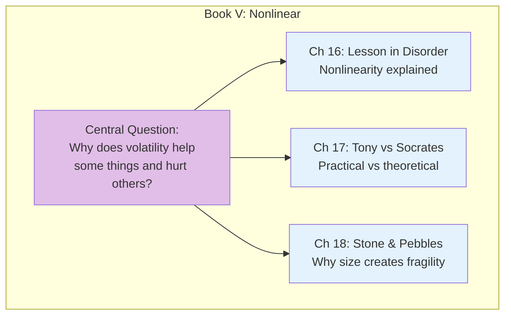
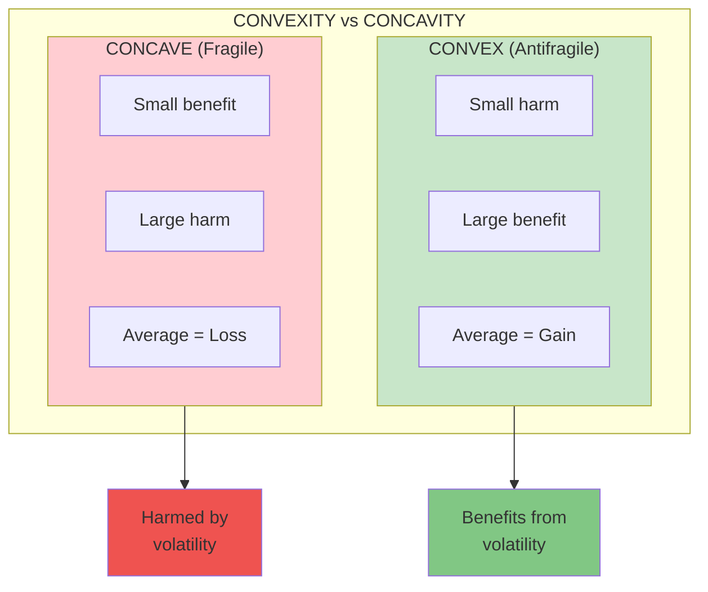

# Book V: The Nonlinear and the Nonlinear

This book dives into the mathematics of antifragility: **nonlinearity**. Understanding convexity and concavity explains why some things gain from volatility while others are destroyed by it.

## Book Overview

## Chapters in This Book

| Chapter | Title | Key Idea |
|---------|-------|----------|
| [16](/chapters/book-5-nonlinear/ch16-lesson-disorder/) | A Lesson in Disorder | Nonlinearity and why it matters |
| [17](/chapters/book-5-nonlinear/ch17-tony-socrates/) | Fat Tony Debates Socrates | Practical wisdom vs logic |
| [18](/chapters/book-5-nonlinear/ch18-stone-pebbles/) | Stone and Pebbles | Why large is fragile |

## Key Themes

- **Nonlinearity** — Outputs don't scale proportionally with inputs
- **Convexity** — Accelerating gains from volatility
- **Concavity** — Accelerating losses from volatility
- **Size and Fragility** — Why large things are inherently fragile

## The Convexity Principle

## Related Concepts

- [Optionality](/concepts/optionality/) - Convex payoff structures
- [Barbell Strategy](/concepts/barbell-strategy/) - Maximizing convexity

---

**Start reading:** [Chapter 16: A Lesson in Disorder →](/chapters/book-5-nonlinear/ch16-lesson-disorder/)
