# Chapter 19: The Philosopher's Stone and Its Inverse

> "The philosopher's stone was the substance that could turn lead into gold. But if the key to life were via negativa, we don't need this stone."

## The Core Insight

The legendary philosopher's stone could turn lead into gold—via positiva (adding value). But the inverse is often more powerful: removing what's harmful (via negativa). You don't need to add gold; just remove the lead.

## Visual: Via Negativa vs Via Positiva

## Why Subtraction Works Better

## The Asymmetry of Knowledge

## Applications of Via Negativa

```mermaid
flowchart TB
    Applications["VIA NEGATIVA APPLIED"]

    Applications --> Health["🏥 Health<br/>Remove toxins, bad food<br/>Don't add supplements"]
    Applications --> Wealth["💰 Wealth<br/>Avoid losses<br/>Don't chase gains"]
    Applications --> Career["💼 Career<br/>Stop bad habits<br/>Don't add new systems"]
    Applications --> Thinking["🧠 Thinking<br/>Remove biases<br/>Don't add complexity"]

    style Applications fill:#e1bee7
```

## Charlatans vs Wise

## Key Takeaways

1. **Subtract first** — Remove harm before adding good
2. **Negative knowledge** — We know what's wrong more than what's right
3. **Less risky** — Removal is more predictable than addition
4. **Avoid charlatans** — They always want to add things

## Think About It

- What could you remove from your life right now?
- What additions have actually made things worse?
- Where do you add when you should subtract?

## Related

- **Previous:** [Book VI Overview](/chapters/book-6-via-negativa/overview/)
- **Next:** [Chapter 20: Time and Fragility](/chapters/book-6-via-negativa/ch20-time-fragility/)
- **Concept:** [Via Negativa](/concepts/via-negativa/)
