# Chapter 20: Time and Fragility

> "For the perishable, every additional day in its life translates into a shorter additional life expectancy. For the nonperishable, every additional day may imply a longer life expectancy."

## The Core Insight

The **Lindy Effect** states that for non-perishable things (ideas, books, technologies), expected future lifespan is proportional to past lifespan. A book that has been in print for 100 years will likely be in print for another 100. Time is the ultimate filter.

## Visual: The Lindy Effect

## Time as a Filter

```mermaid
flowchart LR
    subgraph Filter["TIME FILTERS FRAGILITY"]
        Start["Millions of<br/>ideas/things"]
        Time["⏳ TIME<br/>passes"]
        Survives["Few<br/>survive"]

        Start --> Time --> Survives
    end

    Survives --> Robust["Survivors are<br/>ROBUST"]

    style Start fill:#e1bee7
    style Survives fill:#c8e6c9
    style Robust fill:#81c784
```

## Lindy Applied

## Old vs New

## Fragility Revealed by Time

## Key Takeaways

1. **Time is a test** — Survival = robustness
2. **Old things have future** — Non-perishables gain from age
3. **Be skeptical of new** — Most new things will fail
4. **Trust Lindy** — Age is the best quality signal

## Think About It

- What old things in your life are Lindy-approved?
- What new things might you be overvaluing?
- How can you apply Lindy filtering to your choices?

## Related

- **Previous:** [Chapter 19: Philosopher's Stone](/chapters/book-6-via-negativa/ch19-philosophers-stone/)
- **Next:** [Chapter 21: Medicine](/chapters/book-6-via-negativa/ch21-medicine/)
- **Concept:** [Lindy Effect](/concepts/lindy-effect/)
