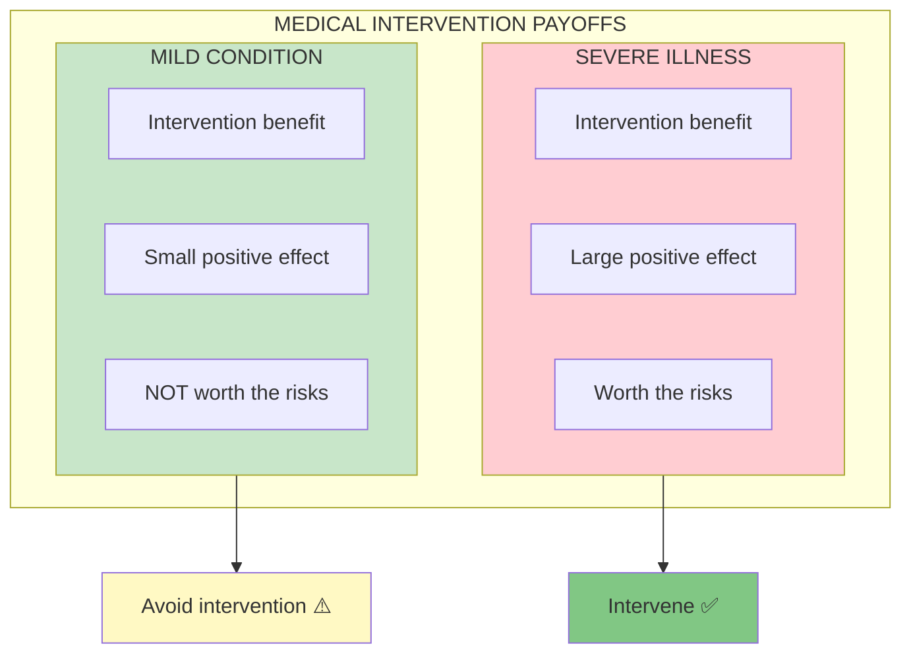
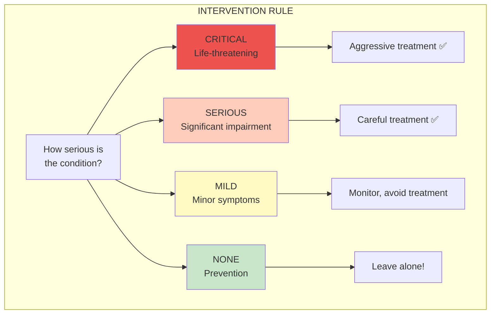
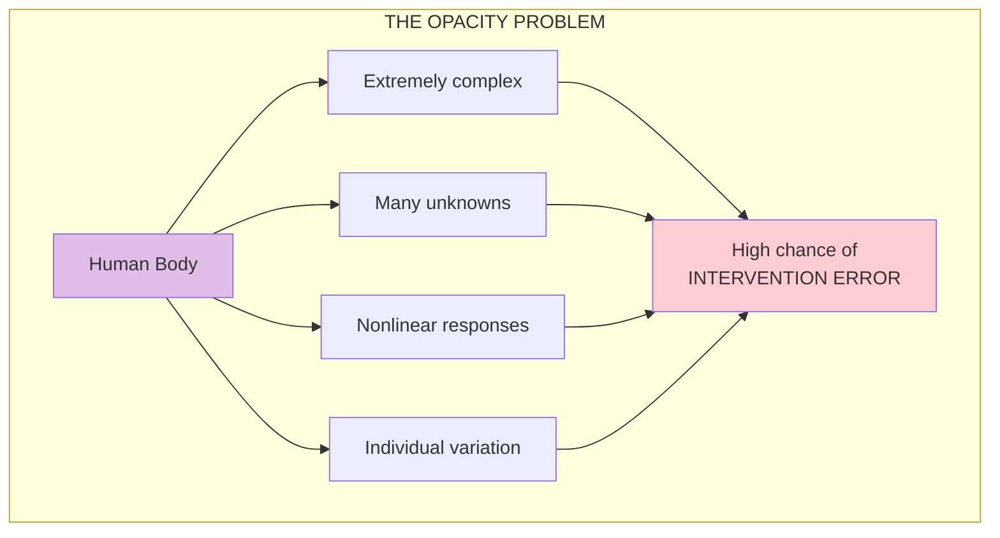
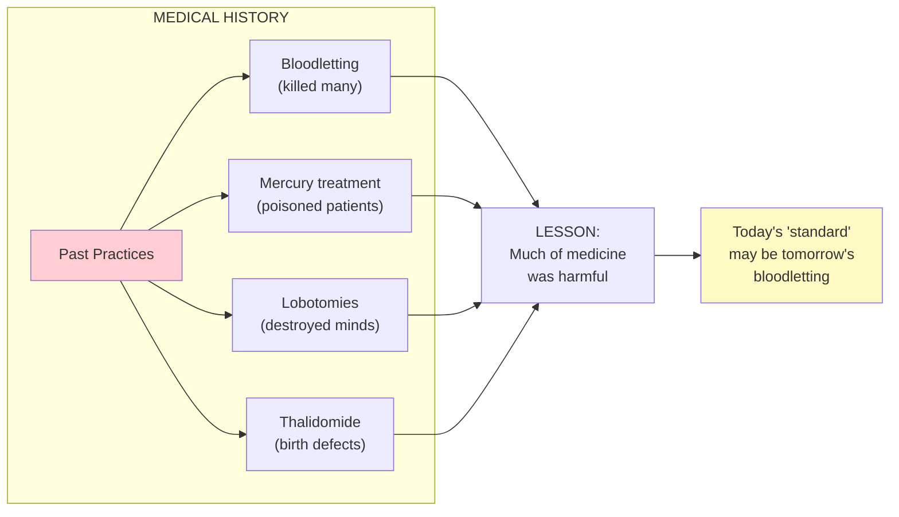
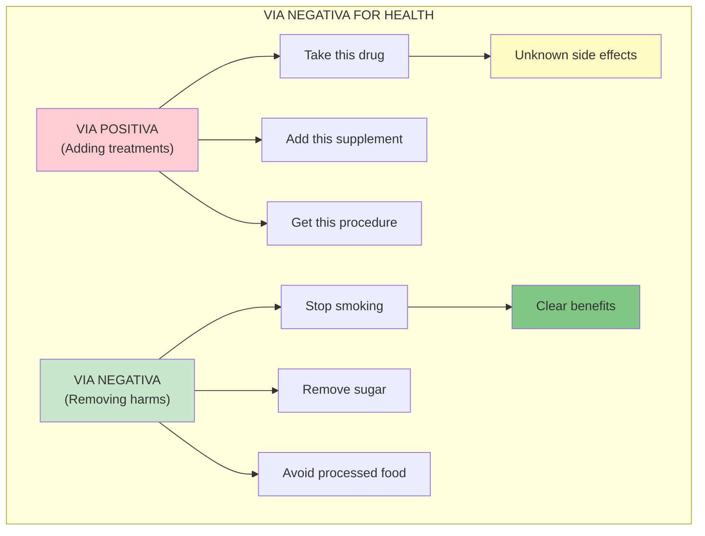

# Chapter 21: Medicine, Convexity, and Opacity

> "The first principle is that you must not fool yourself—and you are the easiest person to fool." — Richard Feynman

## The Core Insight

Medicine is a domain where iatrogenics (harm from treatment) is rampant. The body is opaque (we don't fully understand it), treatments are often concave (more risk than benefit), and the desire to "do something" leads to harmful interventions.

## Visual: Medical Convexity

## The Convexity Rule for Medicine

## Opacity and Error

## History of Medical Iatrogenics

## Via Negativa in Medicine

## Key Takeaways

1. **Sicker = more intervention** — Intervention justified by severity
2. **Don't treat mild conditions** — Side effects often outweigh benefits
3. **Body is opaque** — We understand less than we think
4. **Via negativa first** — Remove harms before adding treatments

## Think About It

- What medical interventions might be unnecessary in your life?
- Where are you treating mild conditions with risky interventions?
- What harms could you remove via negativa?

## Related

- **Previous:** [Chapter 20: Time and Fragility](/chapters/book-6-via-negativa/ch20-time-fragility/)
- **Next:** [Chapter 22: Live Long](/chapters/book-6-via-negativa/ch22-live-long/)
- **Concept:** [Iatrogenics](/concepts/iatrogenics/)
