# Chapter 22: To Live Long, but Not Too Long

> "The three most harmful addictions are heroin, carbohydrates, and a monthly salary."

## The Core Insight

Longevity comes not from adding things (supplements, interventions) but from removing harms (via negativa), exposing yourself to natural stressors (hormesis), and avoiding the modern diseases of comfort.

## Visual: Longevity Principles

## What to Remove (Via Negativa)

```mermaid
flowchart TB
    subgraph Remove["REMOVE THESE"]
        R1["🚬 Smoking"]
        R2["🍬 Sugar/processed carbs"]
        R3["🍔 Processed food"]
        R4["💊 Unnecessary medications"]
        R5["📺 Sedentary behavior"]
        R6["😰 Chronic stress"]
    end

    R1 --> Benefits["Clear, proven<br/>health benefits"]
    R2 --> Benefits
    R3 --> Benefits
    R4 --> Benefits
    R5 --> Benefits
    R6 --> Benefits

    style Remove fill:#ffcdd2
    style Benefits fill:#81c784
```

## Beneficial Stressors (Hormesis)

```mermaid
flowchart TB
    subgraph Stressors["BENEFICIAL STRESSORS"]
        S1["🏋️ Intense exercise"]
        S2["🥶 Cold exposure"]
        S3["🍽️ Intermittent fasting"]
        S4["☀️ Sun exposure (moderate)"]
        S5["🧠 Mental challenges"]
    end

    S1 --> Response["Body ADAPTS<br/>and strengthens"]
    S2 --> Response
    S3 --> Response
    S4 --> Response
    S5 --> Response

    style Stressors fill:#c8e6c9
    style Response fill:#81c784
```

## Lindy Foods and Activities

## Modern vs Ancestral

## The Longevity Formula

## Key Takeaways

1. **Remove first** — Via negativa is the primary tool
2. **Embrace stressors** — Hormesis makes you stronger
3. **Trust Lindy** — Old foods and practices are tested
4. **Avoid modern comfort** — It creates fragility

## Think About It

- What modern "conveniences" might be harming you?
- What natural stressors could you reintroduce?
- How can you align more with ancestral patterns?

## Related

- **Previous:** [Chapter 21: Medicine](/chapters/book-6-via-negativa/ch21-medicine/)
- **Next:** [Book VII Overview](/chapters/book-7-ethics/overview/)
- **Concept:** [Via Negativa](/concepts/via-negativa/)
