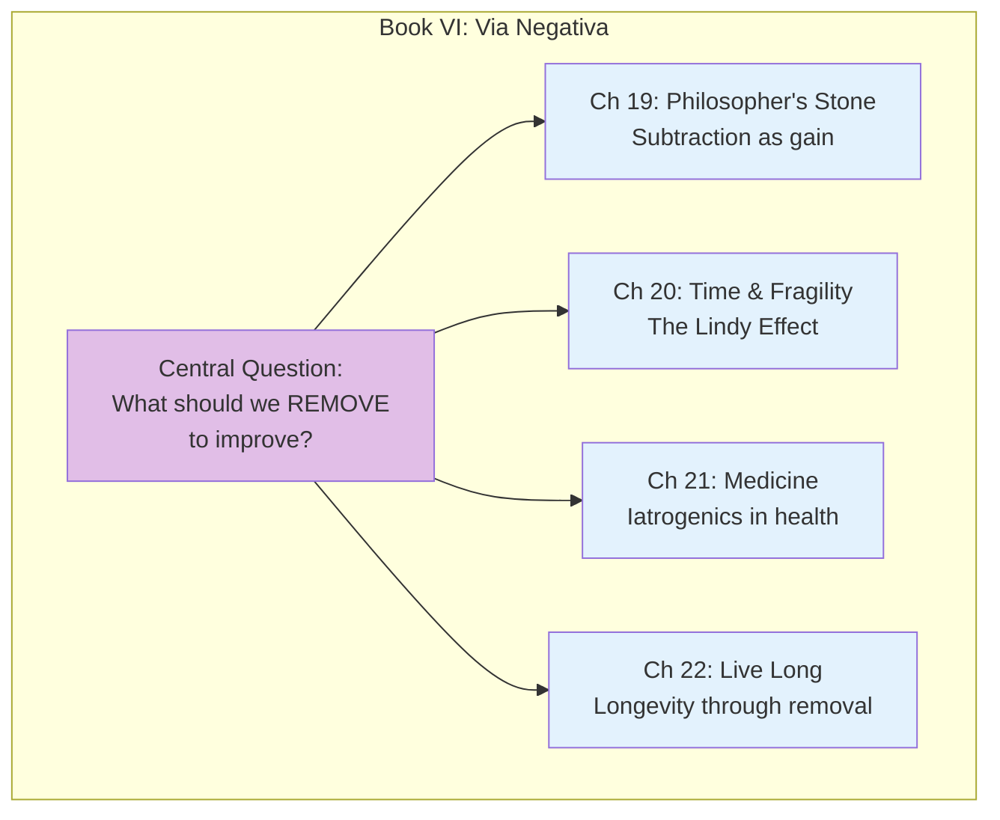
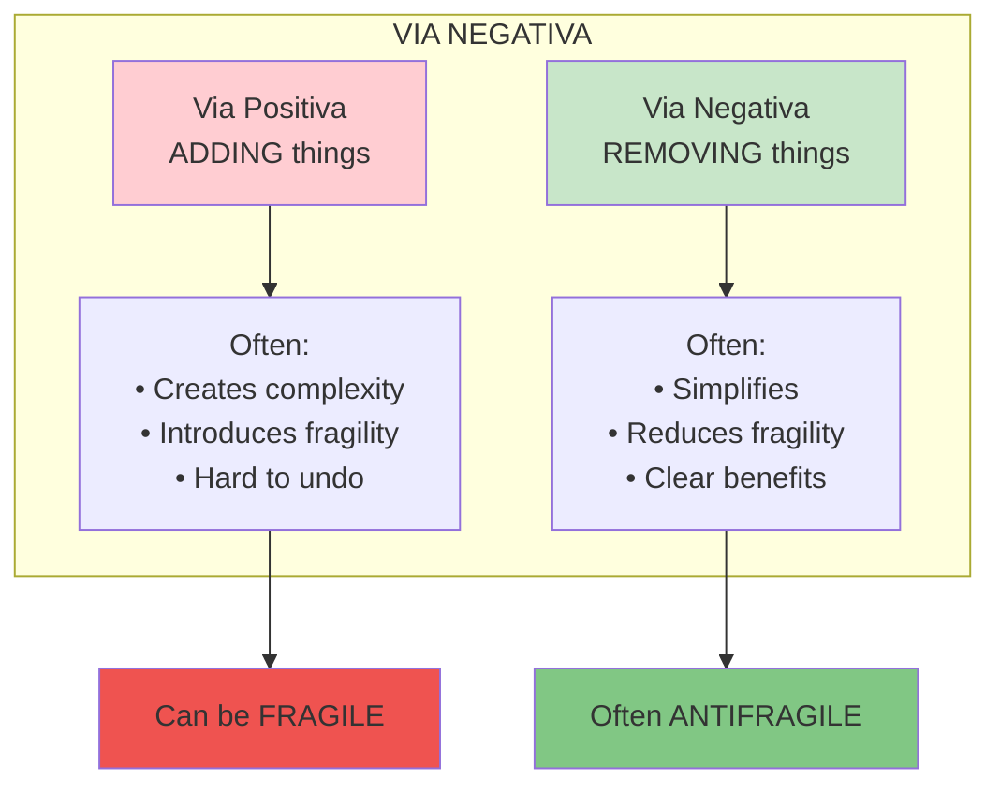

# Book VI: Via Negativa

This book introduces one of the most powerful concepts: **Via Negativa**—the idea that you gain more by removing than by adding. Subtraction is often more powerful than addition.

## Book Overview

## Chapters in This Book

| Chapter | Title | Key Idea |
|---------|-------|----------|
| [19](/chapters/book-6-via-negativa/ch19-philosophers-stone/) | The Philosopher's Stone | Gaining by removing |
| [20](/chapters/book-6-via-negativa/ch20-time-fragility/) | Time and Fragility | The Lindy Effect |
| [21](/chapters/book-6-via-negativa/ch21-medicine/) | Medicine, Convexity, and Opacity | Medical iatrogenics |
| [22](/chapters/book-6-via-negativa/ch22-live-long/) | To Live Long, but Not Too Long | Longevity principles |

## Key Themes

- **Via Negativa** — Knowledge through removal/negation
- **Lindy Effect** — The longer something survives, the longer it will survive
- **Medical Iatrogenics** — Harm from medical intervention
- **Subtraction over Addition** — Less is often more

## The Via Negativa Principle

## Related Concepts

- [Via Negativa](/concepts/via-negativa/) - The full concept
- [Lindy Effect](/concepts/lindy-effect/) - Survival and time
- [Iatrogenics](/concepts/iatrogenics/) - Harm from helpers

---

**Start reading:** [Chapter 19: The Philosopher's Stone →](/chapters/book-6-via-negativa/ch19-philosophers-stone/)
