# Chapter 23: Skin in the Game

> "Never trust anyone who doesn't have skin in the game."

## The Core Insight

**Skin in the game** means that those who make decisions must bear the consequences. This is not just good ethics—it's essential for system stability. When decision-makers don't bear costs, they take reckless risks that create fragility.

## Visual: Skin in the Game Principle

```mermaid
flowchart TB
    subgraph SITG["SKIN IN THE GAME"]
        Decision["Makes Decision"]
        Bears["Bears Consequences"]

        Decision --> Same["SAME PERSON"]
        Bears --> Same

        Same --> Result["✅ Aligned incentives<br/>✅ Careful decisions<br/>✅ System learns<br/>✅ Antifragile"]
    end

    style Same fill:#c8e6c9
    style Result fill:#81c784
```

## Without Skin in the Game

```mermaid
flowchart TB
    subgraph NoSITG["NO SKIN IN GAME"]
        Decide["Person A<br/>Makes Decision"]
        Suffer["Person B<br/>Bears Consequences"]

        Decide --> Separate["DIFFERENT PEOPLE"]
        Suffer --> Separate

        Separate --> Problem["❌ Misaligned incentives<br/>❌ Reckless decisions<br/>❌ System doesn't learn<br/>❌ Fragile"]
    end

    style Separate fill:#ffcdd2
    style Problem fill:#ef5350
```

## Examples of Missing Skin in Game

```mermaid
flowchart TB
    Examples["MISSING SKIN IN GAME"]

    Examples --> Bankers["🏦 Bankers<br/>Bonuses for gains,<br/>bailouts for losses"]
    Examples --> Politicians["🏛️ Politicians<br/>Vote for wars,<br/>don't fight them"]
    Examples --> Consultants["💼 Consultants<br/>Give advice,<br/>don't live with results"]
    Examples --> Academics["🎓 Academics<br/>Theorize policies,<br/>don't bear consequences"]

    Bankers --> Fragile["Creates<br/>SYSTEMIC FRAGILITY"]
    Politicians --> Fragile
    Consultants --> Fragile
    Academics --> Fragile

    style Examples fill:#e1bee7
    style Fragile fill:#ef5350
```

## The Agency Problem

## Historical Skin in Game

```mermaid
flowchart TB
    subgraph History["HISTORICAL EXAMPLES"]
        Romans["🏛️ Romans<br/>Engineers stood under<br/>bridges they built"]
        Hammurabi["⚖️ Hammurabi<br/>Builder killed if<br/>house collapsed"]
        Captains["🚢 Ship Captains<br/>Last off sinking ship"]
    end

    Romans --> Principle["Accountability<br/>= Quality"]
    Hammurabi --> Principle
    Captains --> Principle

    style Romans fill:#c8e6c9
    style Hammurabi fill:#c8e6c9
    style Captains fill:#c8e6c9
    style Principle fill:#81c784
```

## Asymmetries to Watch

## Key Takeaways

1. **Aligned incentives** — Decision-makers must bear consequences
2. **Filter for trust** — Only trust those with skin in game
3. **System stability** — Missing skin creates fragility
4. **Ancient wisdom** — Hammurabi knew this 4000 years ago

## Think About It

- Who gives you advice without skin in the game?
- Where do you have skin in the game? Where don't you?
- What systems around you have dangerous asymmetries?

## Related

- **Previous:** [Book VII Overview](/chapters/book-7-ethics/overview/)
- **Next:** [Chapter 24: Fitting Ethics](/chapters/book-7-ethics/ch24-fitting-ethics/)
- **Concept:** [Skin in the Game](/concepts/skin-in-the-game/)
