# Chapter 24: Fitting Ethics to a Profession

> "Ethics should be determined by the nature of the activity."

## The Core Insight

Different professions require different ethical frameworks based on their **asymmetries**. What's ethical in commerce may not be in medicine; what's appropriate for a trader differs from a doctor. Ethics must fit the fragility profile of the domain.

## Visual: Ethics Vary by Domain

```mermaid
flowchart TB
    subgraph Domains["ETHICS BY DOMAIN"]
        subgraph Commerce["💰 COMMERCE"]
            C1["Caveat emptor<br/>(Buyer beware)"]
            C2["Both parties have<br/>skin in game"]
            C3["Self-correcting"]
        end

        subgraph Medicine["🏥 MEDICINE"]
            M1["First, do no harm"]
            M2["Patient vulnerable,<br/>doctor powerful"]
            M3["Asymmetric knowledge"]
        end

        subgraph Public["🏛️ PUBLIC SERVICE"]
            P1["Serve the public"]
            P2["Power without<br/>market correction"]
            P3["Must have constraints"]
        end
    end

    style Commerce fill:#b3e5fc
    style Medicine fill:#c8e6c9
    style Public fill:#e1bee7
```

## The Asymmetry Principle

## Soul in the Game

## Professional Ethics Spectrum

## The Artisan Ethic

## Warning: Bureaucratic Ethics

## Key Takeaways

1. **Ethics depend on context** — Different domains need different rules
2. **Asymmetry matters** — More power/knowledge = higher standards
3. **Soul in the game** — Honor and reputation also align incentives
4. **Beware bureaucrats** — No skin or soul creates danger

## Think About It

- What ethical framework fits your profession?
- Where do you have both skin and soul in the game?
- What bureaucratic systems lack proper accountability?

## Related

- **Previous:** [Chapter 23: Skin in Game](/chapters/book-7-ethics/ch23-skin-game/)
- **Next:** [Chapter 25: Conclusion](/chapters/book-7-ethics/ch25-conclusion/)
- **Concept:** [Skin in the Game](/concepts/skin-in-the-game/)
