# Chapter 25: Conclusion

> "Wind extinguishes a candle and energizes fire. Likewise with randomness, uncertainty, chaos: you want to use them, not hide from them."

## The Core Message

The world is uncertain, and uncertainty is not something to fear but to embrace. **Antifragility** is the property that allows systems—and people—to thrive from the very disorder that destroys the fragile.

## Visual: The Complete Framework

## The Key Principles Summarized

## From Fragile to Antifragile

## Practical Application Checklist

```mermaid
flowchart TB
    subgraph Checklist["BECOME ANTIFRAGILE"]
        C1["☐ Identify fragilities"]
        C2["☐ Remove what harms"]
        C3["☐ Add beneficial stressors"]
        C4["☐ Build redundancy"]
        C5["☐ Create options"]
        C6["☐ Trust the old"]
        C7["☐ Doubt the new"]
        C8["☐ Stay accountable"]
    end

    style Checklist fill:#c8e6c9
```

## The Final Insight

```mermaid
flowchart TB
    subgraph Final["THE FINAL INSIGHT"]
        Wind["⚡ RANDOMNESS<br/>VOLATILITY<br/>STRESS"]

        Wind --> Candle["🕯️ Candle<br/>(Fragile)"]
        Wind --> Fire["🔥 Fire<br/>(Antifragile)"]

        Candle --> Out["Extinguished"]
        Fire --> Energized["Energized"]
    end

    Fire --> Become["BE THE FIRE"]

    style Wind fill:#e1bee7
    style Candle fill:#ffcdd2
    style Fire fill:#c8e6c9
    style Out fill:#ef5350
    style Energized fill:#81c784
    style Become fill:#2e7d32,color:white
```

## Key Takeaways

1. **Antifragility is the goal** — Not just surviving but thriving
2. **Uncertainty is opportunity** — When you're positioned correctly
3. **Simple beats complex** — Via negativa and Lindy
4. **Accountability matters** — Skin in the game for ethical systems
5. **Be the fire** — Use randomness to grow stronger

## Where to Go From Here

- **Explore [Key Concepts](/concepts/antifragility/)** — Deep dive into specific ideas
- **Follow [Learning Paths](/paths/core-framework/)** — Guided application journeys
- **Reread chapters** — Each reading reveals more

---

> "The antifragile loves randomness and uncertainty, which also means—crucially—a love of errors... The antifragile is immune to prediction errors."

**Be antifragile. Be the fire, not the candle.**
