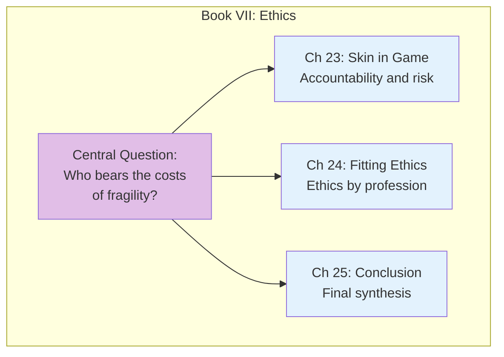
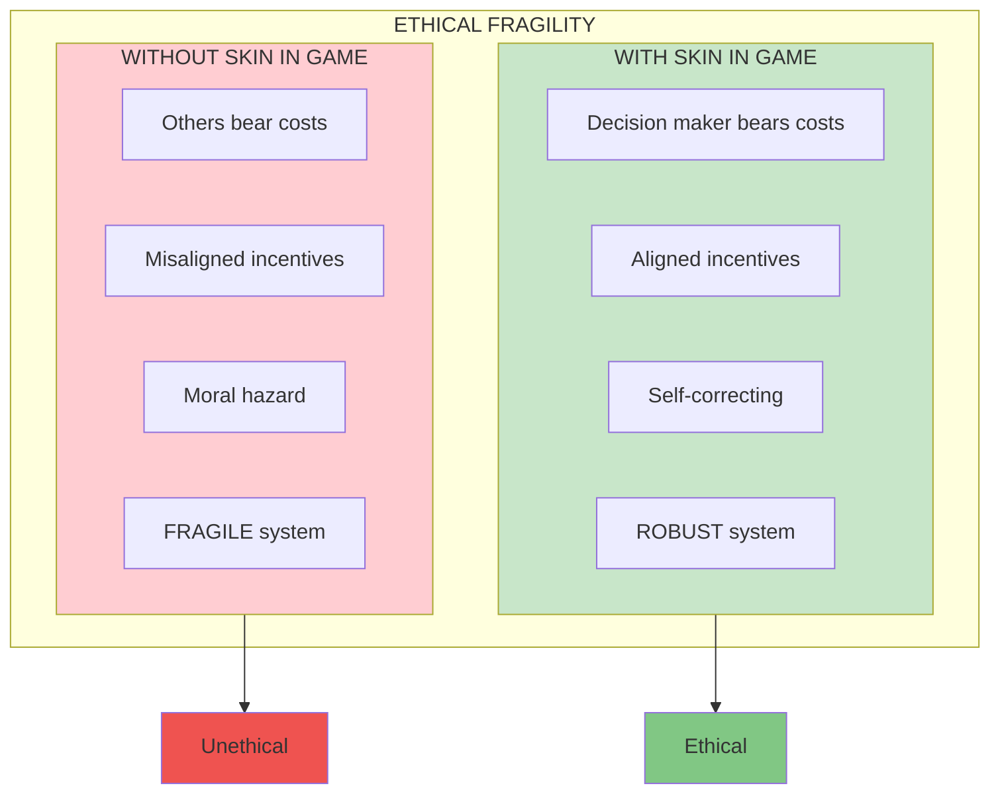

# Book VII: The Ethics of Fragility and Antifragility

This final book addresses the **ethical dimension** of antifragility: the crucial importance of skin in the game, and how separating risk-takers from risk-bearers creates systemic fragility and moral hazard.

## Book Overview

## Chapters in This Book

| Chapter | Title | Key Idea |
|---------|-------|----------|
| [23](/chapters/book-7-ethics/ch23-skin-game/) | Skin in the Game | Those who take risks must bear costs |
| [24](/chapters/book-7-ethics/ch24-fitting-ethics/) | Fitting Ethics to a Profession | Different domains, different rules |
| [25](/chapters/book-7-ethics/ch25-conclusion/) | Conclusion | Bringing it all together |

## Key Themes

- **Skin in the Game** — Risk-takers must be risk-bearers
- **Agency Problem** — When others bear your risks
- **Moral Hazard** — Incentives for reckless behavior
- **Ethical Systems** — Robust vs fragile ethics

## The Core Ethical Principle

## Related Concepts

- [Skin in the Game](/concepts/skin-in-the-game/) - Full concept explanation
- [The Triad](/concepts/triad/) - Fragile, robust, antifragile classification

---

**Start reading:** [Chapter 23: Skin in the Game →](/chapters/book-7-ethics/ch23-skin-game/)
