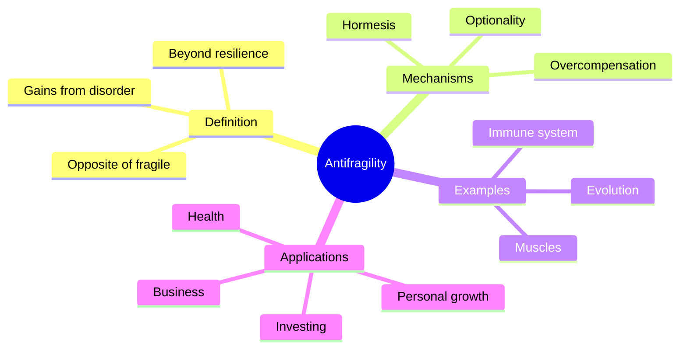
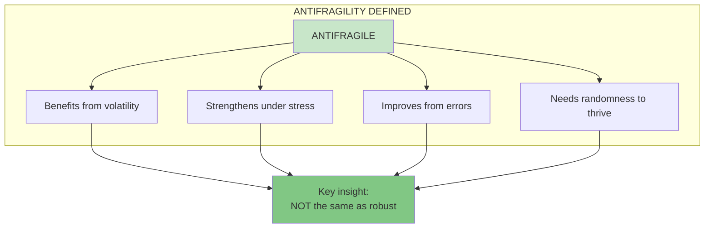
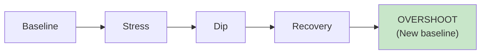
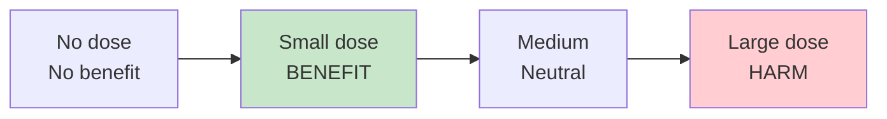
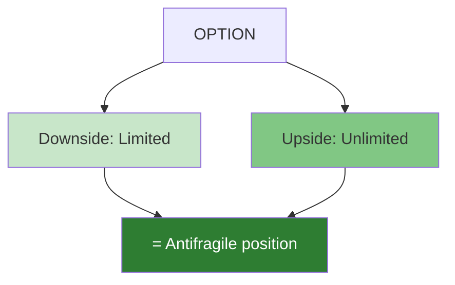
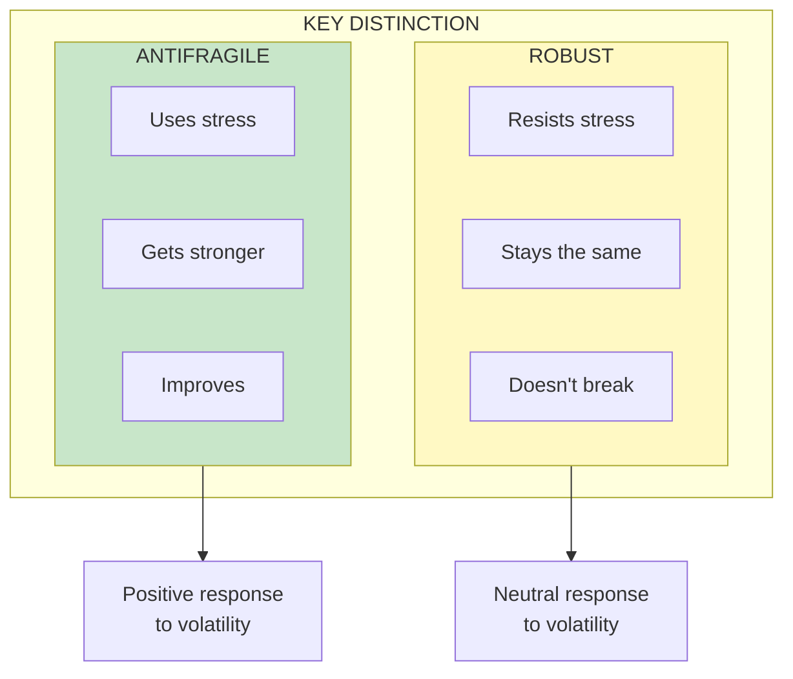

# Antifragility

Antifragility is the property of systems that **gain from disorder**—beyond just surviving stress, they actually become stronger, better, or more capable when exposed to volatility, randomness, and stressors.

## Concept Overview

## The Core Definition

## How Antifragility Works

### Overcompensation
Systems don't just recover from stress—they overshoot and become stronger than before.

### Hormesis
Small doses of harm produce beneficial effects.

### Optionality
Asymmetric payoffs with limited downside and unlimited upside.

## Where This Appears in the Book

| Chapter | Context | Key Insight |
|---------|---------|-------------|
| [Ch 1](/chapters/book-1-antifragile-introduction/ch1-damocles-hydra/) | The Triad | Introducing fragile-robust-antifragile |
| [Ch 2](/chapters/book-1-antifragile-introduction/ch2-overcompensation/) | Overcompensation | How systems strengthen from stress |
| [Ch 3](/chapters/book-1-antifragile-introduction/ch3-cat-washing-machine/) | Organic systems | Living things are antifragile |
| [Ch 6](/chapters/book-2-modernity/ch6-love-randomness/) | Randomness | Why some randomness helps |
| [Ch 12](/chapters/book-4-optionality/ch12-thales-grapes/) | Options | Optionality creates antifragility |

## Antifragility vs Robustness

## Related Concepts

- [The Triad](/concepts/triad/) — The classification system
- [Optionality](/concepts/optionality/) — Mechanism of antifragility
- [Via Negativa](/concepts/via-negativa/) — Gaining through subtraction
- [Barbell Strategy](/concepts/barbell-strategy/) — Practical application
