# Barbell Strategy

The **Barbell Strategy** is a bimodal approach: instead of moderate risk, you combine extreme safety (90%) with extreme speculation (10%). This eliminates catastrophic downside while preserving unlimited upside.

## Concept Overview

## The Barbell Shape

```mermaid
flowchart LR
    subgraph Barbell["THE BARBELL"]
        Safe["🛡️ SAFE SIDE<br/>90%<br/>Cash, bonds,<br/>very safe assets"]
        Middle["❌ AVOID<br/>THE MIDDLE<br/>Medium risk"]
        Risk["🎯 SPECULATIVE SIDE<br/>10%<br/>High-risk,<br/>high-reward bets"]
    end

    Safe ---|"Weight"| Middle
    Middle ---|"Weight"| Risk

    style Safe fill:#b3e5fc
    style Middle fill:#ffcdd2
    style Risk fill:#c8e6c9
```

## Why Avoid the Middle

## Barbell Payoff Structure

```mermaid
flowchart TB
    subgraph Payoff["BARBELL PAYOFF"]
        Scenario["Any Scenario"]

        Scenario --> Disaster["DISASTER"]
        Scenario --> Normal["NORMAL"]
        Scenario --> Great["BLACK SWAN +"]

        Disaster --> D_Result["Safe side protects<br/>You survive"]
        Normal --> N_Result["Safe side preserves<br/>Speculative may grow"]
        Great --> G_Result["Speculative side explodes<br/>Massive gains"]
    end

    D_Result --> Survive["Can't be ruined ✅"]
    N_Result --> Survive
    G_Result --> Win["Can hit big wins ✅"]

    style Disaster fill:#ffcdd2
    style Great fill:#c8e6c9
    style Survive fill:#81c784
    style Win fill:#2e7d32,color:white
```

## Applications

```mermaid
flowchart TB
    Applications["BARBELL APPLICATIONS"]

    Applications --> Invest["💰 INVESTING<br/>90% Treasury bonds<br/>10% Venture capital"]
    Applications --> Career["💼 CAREER<br/>Stable job<br/>+ Side experiments"]
    Applications --> Learning["📚 LEARNING<br/>Deep expertise<br/>+ Wild exploration"]
    Applications --> Health["🏥 HEALTH<br/>Very safe baseline<br/>+ Intense exercise"]

    style Applications fill:#e1bee7
```

## Barbell vs Moderate Risk

## Where This Appears in the Book

| Chapter | Context | Key Insight |
|---------|---------|-------------|
| [Ch 10](/chapters/book-3-nonpredictive/ch10-seneca/) | Seneca's approach | Enjoy wealth, prepared for loss |
| [Ch 11](/chapters/book-3-nonpredictive/ch11-rock-star/) | Avoiding concentration | Diversification extreme form |
| [Ch 12](/chapters/book-4-optionality/ch12-thales-grapes/) | Optionality | Barbell is optionality |
| [Ch 18](/chapters/book-5-nonlinear/ch18-stone-pebbles/) | Size | Distribution protects |

## Related Concepts

- [Optionality](/concepts/optionality/) — Barbell maximizes options
- [Antifragility](/concepts/antifragility/) — Barbell creates antifragility
- [The Triad](/concepts/triad/) — Combines robust (safe) with antifragile (speculative)
