# Iatrogenics

**Iatrogenics** (from Greek: "caused by the healer") is harm done by the person or system trying to help. Originally a medical term, Taleb extends it to all domains where intervention causes more harm than benefit.

## Concept Overview

## The Iatrogenics Problem

## When Intervention Helps vs Harms

```mermaid
flowchart TB
    Condition["Condition Severity"]

    Condition --> Severe["SEVERE<br/>(life-threatening)"]
    Condition --> Mild["MILD<br/>(minor issue)"]

    Severe --> S_Int["Intervention"]
    Mild --> M_Int["Intervention"]

    S_Int --> S_R["✅ Benefit > Risk<br/>Intervene!"]
    M_Int --> M_R["❌ Risk > Benefit<br/>Don't intervene!"]

    style Severe fill:#ef5350
    style Mild fill:#fff9c4
    style S_R fill:#c8e6c9
    style M_R fill:#ffcdd2
```

## Examples Across Domains

```mermaid
flowchart TB
    Examples["IATROGENICS EXAMPLES"]

    Examples --> Med["🏥 MEDICINE<br/>Over-prescription,<br/>unnecessary surgery"]
    Examples --> Econ["💰 ECONOMICS<br/>Bailouts creating<br/>moral hazard"]
    Examples --> Policy["🏛️ POLICY<br/>Regulations with<br/>perverse incentives"]
    Examples --> Parent["👨‍👩‍👧 PARENTING<br/>Helicopter parenting<br/>creating fragile children"]

    style Examples fill:#e1bee7
```

## The Severity Threshold

```mermaid
flowchart TB
    subgraph Threshold["INTERVENTION THRESHOLD"]
        Severity["How severe?"]

        Severity --> Critical["CRITICAL"]
        Severity --> Serious["SERIOUS"]
        Severity --> Mild["MILD"]
        Severity --> None["PREVENTIVE"]

        Critical --> Do["Intervene aggressively ✅"]
        Serious --> Maybe["Intervene carefully ✅"]
        Mild --> Avoid["Avoid intervention ⚠️"]
        None --> Dont["Don't intervene ❌"]
    end

    style Critical fill:#ef5350
    style Serious fill:#ffccbc
    style Mild fill:#fff9c4
    style None fill:#c8e6c9
```

## Prevention: Via Negativa

## Where This Appears in the Book

| Chapter | Context | Key Insight |
|---------|---------|-------------|
| [Ch 7](/chapters/book-2-modernity/ch7-naive-intervention/) | Naive intervention | The helper's harm |
| [Ch 21](/chapters/book-6-via-negativa/ch21-medicine/) | Medicine | Medical iatrogenics |
| [Ch 22](/chapters/book-6-via-negativa/ch22-live-long/) | Longevity | Avoid unnecessary treatment |

## Related Concepts

- [Via Negativa](/concepts/via-negativa/) — Prevention of iatrogenics
- [Skin in the Game](/concepts/skin-in-the-game/) — Missing SITG enables iatrogenics
- [Antifragility](/concepts/antifragility/) — Iatrogenics suppresses it
