# Lindy Effect

The **Lindy Effect** states that for non-perishable things (ideas, books, technologies), expected future lifespan is proportional to their current age. Something that has survived 1000 years can be expected to survive another 1000.

## Concept Overview

## The Lindy Principle

## Time as Filter

## Applications

```mermaid
flowchart TB
    Lindy["LINDY-APPROVED"]

    Lindy --> Books["📚 BOOKS<br/>Bible, Homer > bestseller"]
    Lindy --> Tech["💻 TECHNOLOGY<br/>Wheel, hammer > gadget"]
    Lindy --> Ideas["💡 IDEAS<br/>Stoicism > self-help"]
    Lindy --> Food["🍎 FOOD<br/>Olive oil > supplement"]
    Lindy --> Practice["🏃 PRACTICE<br/>Walking > new exercise"]

    style Lindy fill:#e1bee7
    style Books fill:#c8e6c9
    style Tech fill:#c8e6c9
    style Ideas fill:#c8e6c9
    style Food fill:#c8e6c9
    style Practice fill:#c8e6c9
```

## Old vs New

## Where This Appears in the Book

| Chapter | Context | Key Insight |
|---------|---------|-------------|
| [Ch 20](/chapters/book-6-via-negativa/ch20-time-fragility/) | Core chapter | Time reveals fragility |
| [Ch 22](/chapters/book-6-via-negativa/ch22-live-long/) | Longevity | Lindy foods and practices |
| [Ch 15](/chapters/book-4-optionality/ch15-history-losers/) | History | Old things undervalued |

## Related Concepts

- [Via Negativa](/concepts/via-negativa/) — Time subtracts the fragile
- [Antifragility](/concepts/antifragility/) — Lindy items are robust
- [The Triad](/concepts/triad/) — Lindy filters for robustness
