# Optionality

**Optionality** is having the right, but not the obligation, to take an action. This creates an asymmetric payoff: limited downside (you lose the option cost) but potentially unlimited upside (you benefit if things go well).

## Concept Overview

## The Option Payoff

```mermaid
flowchart TB
    subgraph Option["OPTION STRUCTURE"]
        O["You have an OPTION"]

        O --> Exercise["GOOD OUTCOME"]
        O --> Walk["BAD OUTCOME"]

        Exercise --> Gain["Exercise option:<br/>Unlimited gain 📈"]
        Walk --> Loss["Walk away:<br/>Lose only premium 📉"]
    end

    Gain --> Asymmetry["ASYMMETRIC<br/>= ANTIFRAGILE"]
    Loss --> Asymmetry

    style Gain fill:#c8e6c9
    style Loss fill:#fff9c4
    style Asymmetry fill:#81c784
```

## Why Optionality Creates Antifragility

## Types of Options in Life

```mermaid
flowchart TB
    Options["LIFE OPTIONS"]

    Options --> Financial["💰 FINANCIAL<br/>Stock options, insurance,<br/>savings buffer"]
    Options --> Career["💼 CAREER<br/>Multiple skills,<br/>side projects"]
    Options --> Social["🤝 SOCIAL<br/>Large network,<br/>diverse relationships"]
    Options --> Knowledge["📚 KNOWLEDGE<br/>Broad learning,<br/>multiple domains"]

    Financial --> Creates["All create<br/>OPTIONALITY"]
    Career --> Creates
    Social --> Creates
    Knowledge --> Creates

    style Options fill:#e1bee7
    style Creates fill:#c8e6c9
```

## Option vs Non-Option Position

## Where This Appears in the Book

| Chapter | Context | Key Insight |
|---------|---------|-------------|
| [Ch 8](/chapters/book-2-modernity/ch8-prediction/) | Alternative to prediction | Options beat forecasts |
| [Ch 12](/chapters/book-4-optionality/ch12-thales-grapes/) | Thales example | Classic option strategy |
| [Ch 13](/chapters/book-4-optionality/ch13-lecturing-birds/) | Tinkering | Practice is optionality |
| [Ch 16](/chapters/book-5-nonlinear/ch16-lesson-disorder/) | Convexity | Options are convex |

## Related Concepts

- [Antifragility](/concepts/antifragility/) — Optionality creates it
- [Barbell Strategy](/concepts/barbell-strategy/) — Maximizes optionality
- [The Triad](/concepts/triad/) — Options = antifragile position
