# Skin in the Game

**Skin in the Game** is the principle that those who make decisions must bear the consequences of those decisions. It's both an ethical requirement and a systemic necessity for stability.

## Concept Overview

## The Core Principle

```mermaid
flowchart TB
    subgraph SITG["SKIN IN THE GAME"]
        Good["✅ WITH Skin in Game"]
        Bad["❌ WITHOUT Skin in Game"]

        Good --> G1["Decision maker = Risk bearer"]
        Good --> G2["Aligned incentives"]
        Good --> G3["Self-correcting system"]

        Bad --> B1["Decision maker ≠ Risk bearer"]
        Bad --> B2["Misaligned incentives"]
        Bad --> B3["Moral hazard"]
    end

    G3 --> Robust["ROBUST/ANTIFRAGILE"]
    B3 --> Fragile["FRAGILE"]

    style Good fill:#c8e6c9
    style Bad fill:#ffcdd2
    style Robust fill:#81c784
    style Fragile fill:#ef5350
```

## Why It Matters

## Violations

```mermaid
flowchart TB
    Violations["VIOLATIONS OF SITG"]

    Violations --> V1["🏦 Banks<br/>Profits private,<br/>losses socialized"]
    Violations --> V2["🏛️ Politicians<br/>Vote for wars,<br/>don't fight them"]
    Violations --> V3["💼 Consultants<br/>Advise actions,<br/>bear no consequences"]
    Violations --> V4["🎓 Academics<br/>Propose policies,<br/>don't live with results"]

    V1 --> Result["Creates systemic<br/>FRAGILITY"]
    V2 --> Result
    V3 --> Result
    V4 --> Result

    style Violations fill:#e1bee7
    style Result fill:#ef5350
```

## Historical Examples

```mermaid
flowchart TB
    subgraph History["HISTORICAL SITG"]
        H1["⚖️ Hammurabi's Code<br/>Builder dies if<br/>house collapses"]
        H2["🏛️ Roman Engineers<br/>Stood under bridges<br/>they built"]
        H3["🚢 Ship Captains<br/>Last off sinking ship"]
    end

    H1 --> Principle["Accountability<br/>= Quality"]
    H2 --> Principle
    H3 --> Principle

    style H1 fill:#c8e6c9
    style H2 fill:#c8e6c9
    style H3 fill:#c8e6c9
    style Principle fill:#81c784
```

## Where This Appears in the Book

| Chapter | Context | Key Insight |
|---------|---------|-------------|
| [Ch 4](/chapters/book-1-antifragile-introduction/ch4-what-kills-me/) | Fragility transfer | Who bears costs matters |
| [Ch 9](/chapters/book-3-nonpredictive/ch9-fat-tony/) | Fat Tony | Trust those with skin |
| [Ch 23](/chapters/book-7-ethics/ch23-skin-game/) | Core chapter | Full exploration |
| [Ch 24](/chapters/book-7-ethics/ch24-fitting-ethics/) | Professional ethics | Ethics varies by domain |

## Related Concepts

- [Antifragility](/concepts/antifragility/) — SITG creates antifragile systems
- [The Triad](/concepts/triad/) — SITG determines fragility class
- [Iatrogenics](/concepts/iatrogenics/) — Missing SITG enables harm
