# The Triad

The Triad is Taleb's fundamental classification system: everything can be categorized as **fragile** (harmed by volatility), **robust** (indifferent to volatility), or **antifragile** (benefiting from volatility).

## Concept Overview

## The Three Categories

```mermaid
flowchart TB
    subgraph Triad["THE TRIAD"]
        V["⚡ VOLATILITY"]

        V --> F["🏺 FRAGILE"]
        V --> R["🪨 ROBUST"]
        V --> A["🌱 ANTIFRAGILE"]

        F --> FR["Breaks, weakens, dies"]
        R --> RR["Stays the same"]
        A --> AR["Grows, strengthens, thrives"]
    end

    style F fill:#ffcdd2
    style R fill:#fff9c4
    style A fill:#c8e6c9
```

## Mythological Metaphors

```mermaid
flowchart LR
    subgraph Myths["MYTHOLOGICAL TRIAD"]
        D["⚔️ DAMOCLES<br/>Sword overhead"]
        P["🔥 PHOENIX<br/>Rises from ashes"]
        H["🐉 HYDRA<br/>Grows two heads"]
    end

    D --> Fragile["Fragile"]
    P --> Robust["Robust"]
    H --> Antifragile["Antifragile"]

    style D fill:#ffcdd2
    style P fill:#fff9c4
    style H fill:#c8e6c9
```

## Examples Across Domains

## How to Use the Triad

## Where This Appears in the Book

| Chapter | Context | Key Insight |
|---------|---------|-------------|
| [Ch 1](/chapters/book-1-antifragile-introduction/ch1-damocles-hydra/) | Introduction | The mythological triad |
| [Ch 4](/chapters/book-1-antifragile-introduction/ch4-what-kills-me/) | Layers | Fragility transfers between levels |
| [Ch 5](/chapters/book-2-modernity/ch5-souk-office/) | Order types | Organic vs artificial order |

## Related Concepts

- [Antifragility](/concepts/antifragility/) — The key property
- [Optionality](/concepts/optionality/) — Creates antifragility
- [Barbell Strategy](/concepts/barbell-strategy/) — Managing the triad
