# Via Negativa

**Via Negativa** is the principle that you gain more by removing than by adding. Subtraction is often more powerful, predictable, and robust than addition.

## Concept Overview

## The Principle

## Why Subtraction Works Better

## Applications

```mermaid
flowchart TB
    VN["VIA NEGATIVA APPLIED"]

    VN --> Health["🏥 HEALTH<br/>Don't add supplements<br/>REMOVE: smoking, sugar, stress"]

    VN --> Wealth["💰 WEALTH<br/>Don't chase returns<br/>AVOID: losses, debt, risk"]

    VN --> Career["💼 CAREER<br/>Don't add systems<br/>STOP: bad habits, time waste"]

    VN --> Thinking["🧠 THINKING<br/>Don't add theories<br/>ELIMINATE: biases, noise"]

    style VN fill:#e1bee7
    style Health fill:#c8e6c9
    style Wealth fill:#c8e6c9
    style Career fill:#c8e6c9
    style Thinking fill:#c8e6c9
```

## The Checklist Manifesto

## Where This Appears in the Book

| Chapter | Context | Key Insight |
|---------|---------|-------------|
| [Ch 19](/chapters/book-6-via-negativa/ch19-philosophers-stone/) | Core principle | Subtraction as gain |
| [Ch 20](/chapters/book-6-via-negativa/ch20-time-fragility/) | Lindy | Time removes fragile |
| [Ch 21](/chapters/book-6-via-negativa/ch21-medicine/) | Health | Remove harm first |
| [Ch 22](/chapters/book-6-via-negativa/ch22-live-long/) | Longevity | Subtract modern harms |

## Related Concepts

- [Antifragility](/concepts/antifragility/) — The goal
- [Lindy Effect](/concepts/lindy-effect/) — Time as subtractor
- [Iatrogenics](/concepts/iatrogenics/) — Harm from adding
