import { Card, CardGrid } from '@astrojs/starlight/components';

## How to Use This Companion

<CardGrid stagger>
  <Card title="By Chapter" icon="open-book">
    Follow the book's seven-book structure with visual explanations for each chapter.
  </Card>
  <Card title="By Concept" icon="puzzle">
    Explore key concepts like antifragility, via negativa, and the barbell strategy across chapters.
  </Card>
  <Card title="Guided Paths" icon="rocket">
    Follow curated learning sequences for specific goals and applications.
  </Card>
</CardGrid>

## The Big Idea

Some things benefit from shocks; they thrive and grow when exposed to volatility, randomness, disorder, and stressors. Taleb calls this property **antifragility**. It's the opposite of fragile, but it's not the same as robust or resilient. The antifragile gets better when stressed.

```mermaid
flowchart LR
    subgraph Triad["The Central Triad"]
        F["🏺 FRAGILE<br/>Harms from disorder"]
        Ro["🪨 ROBUST<br/>Indifferent to disorder"]
        A["🌱 ANTIFRAGILE<br/>Gains from disorder"]
    end

    Stress["⚡ Stress/<br/>Volatility"] --> F
    Stress --> Ro
    Stress --> A

    F --> Fb["Breaks"]
    Ro --> Rob["Stays same"]
    A --> Ab["Gets stronger"]

    style F fill:#ffcdd2
    style Ro fill:#fff9c4
    style A fill:#c8e6c9
    style Ab fill:#81c784
```

## Book Structure

| Book | Title | Core Theme |
|------|-------|------------|
| I | [The Antifragile](/chapters/book-1-antifragile-introduction/overview/) | Introducing the concept and the Triad |
| II | [Modernity](/chapters/book-2-modernity/overview/) | How modern systems suppress antifragility |
| III | [Nonpredictive](/chapters/book-3-nonpredictive/overview/) | Thriving without forecasting |
| IV | [Optionality](/chapters/book-4-optionality/overview/) | The power of asymmetric bets |
| V | [Nonlinear](/chapters/book-5-nonlinear/overview/) | Understanding convexity and concavity |
| VI | [Via Negativa](/chapters/book-6-via-negativa/overview/) | Gaining by subtraction |
| VII | [Ethics](/chapters/book-7-ethics/overview/) | Skin in the game and moral responsibility |

## Key Concepts Map

## Who Should Read This

- **Decision makers** seeking robust strategies under uncertainty
- **Entrepreneurs** building resilient businesses
- **Investors** understanding risk and optionality
- **Anyone** wanting to thrive in an unpredictable world

---

**Ready to begin?** [Start with Book I: The Antifragile →](/chapters/book-1-antifragile-introduction/overview/)
