```mermaid
flowchart TB
    V["⚡ Volatility"]
    V --> F["🏺 Fragile<br/>Harmed"]
    V --> R["🪨 Robust<br/>Unchanged"]
    V --> A["🌱 Antifragile<br/>Strengthened"]

    style F fill:#ffcdd2
    style R fill:#fff9c4
    style A fill:#c8e6c9
```

# Learning Path: Core Framework

This path takes you through the essential concepts of Antifragile—the ideas you need to understand before diving into applications. Perfect for first-time readers or those wanting to solidify fundamentals.

## Path Overview

---

## Step 1: The Triad

**Goal:** Understand the fundamental classification system

### Read
- [Chapter 1: Damocles and Hydra](/chapters/book-1-antifragile-introduction/ch1-damocles-hydra/)
- [Concept: The Triad](/concepts/triad/)

### Key Diagram

### Check Your Understanding
- [ ] Can you classify things as fragile, robust, or antifragile?
- [ ] Do you understand why robust ≠ antifragile?
- [ ] Can you name the mythological figures for each category?

---

## Step 2: What is Antifragility?

**Goal:** Deeply understand the core concept

### Read
- [Chapter 2: Overcompensation](/chapters/book-1-antifragile-introduction/ch2-overcompensation/)
- [Chapter 3: Cat and Washing Machine](/chapters/book-1-antifragile-introduction/ch3-cat-washing-machine/)
- [Concept: Antifragility](/concepts/antifragility/)

### Key Diagram

### Check Your Understanding
- [ ] Can you explain hormesis?
- [ ] Do you understand overcompensation?
- [ ] Can you distinguish organic from mechanical systems?

---

## Step 3: How Antifragility Works

**Goal:** Understand the mechanisms that create antifragility

### Read
- [Chapter 4: What Kills Me](/chapters/book-1-antifragile-introduction/ch4-what-kills-me/)
- [Chapter 12: Thales' Grapes](/chapters/book-4-optionality/ch12-thales-grapes/)
- [Concept: Optionality](/concepts/optionality/)

### Key Diagram

### Check Your Understanding
- [ ] Do you understand fragility transfer between levels?
- [ ] Can you explain what an option is?
- [ ] Can you identify asymmetric payoffs?

---

## Step 4: Via Negativa

**Goal:** Understand the power of subtraction

### Read
- [Chapter 19: Philosopher's Stone](/chapters/book-6-via-negativa/ch19-philosophers-stone/)
- [Chapter 20: Time and Fragility](/chapters/book-6-via-negativa/ch20-time-fragility/)
- [Concept: Via Negativa](/concepts/via-negativa/)
- [Concept: Lindy Effect](/concepts/lindy-effect/)

### Key Diagram

### Check Your Understanding
- [ ] Can you explain why subtraction is often better than addition?
- [ ] Do you understand the Lindy Effect?
- [ ] Can you apply via negativa to your own life?

---

## Step 5: Integration

**Goal:** Bring it all together

### Read
- [Chapter 25: Conclusion](/chapters/book-7-ethics/ch25-conclusion/)
- Review all concept pages

### Key Diagram

### Check Your Understanding
- [ ] Can you explain the core framework to someone else?
- [ ] Can you identify fragile/robust/antifragile in your life?
- [ ] Do you have a via negativa list of what to remove?

---

## Path Complete!

You now understand:
- ✅ The fundamental triad classification
- ✅ What antifragility means and how it works
- ✅ The mechanisms: overcompensation, hormesis, optionality
- ✅ Via negativa and the Lindy Effect
- ✅ How to apply the framework

**Continue with:** [Practical Application Path →](/paths/practical-application/)
