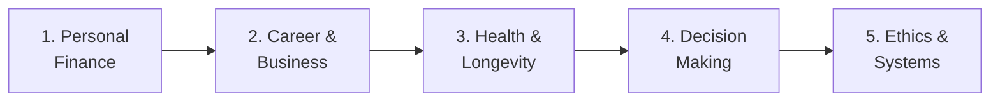
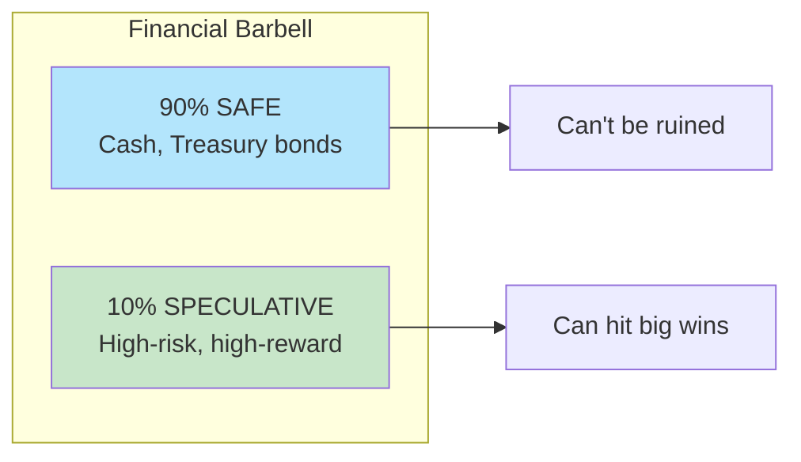
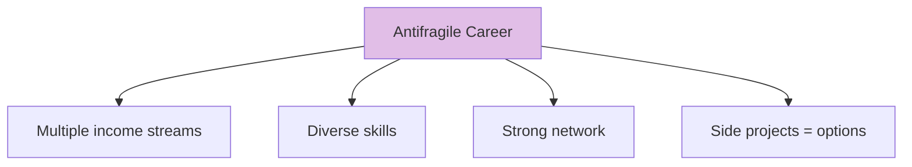
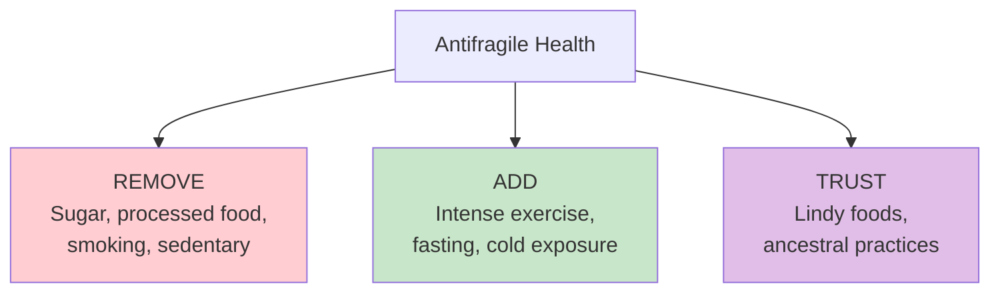
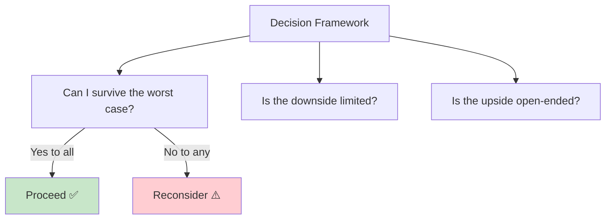
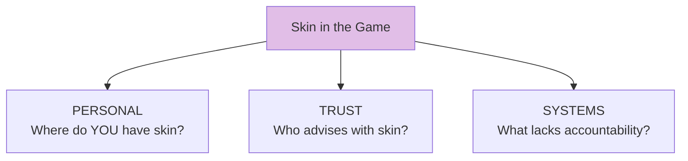

# Learning Path: Practical Application

This path focuses on **applying** antifragile principles to real-world situations: career, investing, health, and decision-making. Best after completing the Core Framework path.

## Path Overview

---

## Step 1: Personal Finance

**Goal:** Apply antifragile principles to wealth and investing

### Read
- [Concept: Barbell Strategy](/concepts/barbell-strategy/)
- [Concept: Optionality](/concepts/optionality/)
- [Chapter 12: Thales' Grapes](/chapters/book-4-optionality/ch12-thales-grapes/)

### Key Diagram

### Action Items
- [ ] Calculate your current risk distribution
- [ ] Identify your "safe" allocation
- [ ] Identify your "speculative" allocation
- [ ] Eliminate medium-risk positions

---

## Step 2: Career & Business

**Goal:** Build an antifragile career and professional life

### Read
- [Chapter 5: Souk and Office](/chapters/book-2-modernity/ch5-souk-office/)
- [Chapter 11: Rock Star](/chapters/book-3-nonpredictive/ch11-rock-star/)
- [Concept: Skin in the Game](/concepts/skin-in-the-game/)

### Key Diagram

### Action Items
- [ ] Identify your single dependencies (rock stars)
- [ ] Develop one additional income source
- [ ] Build skills in an adjacent domain
- [ ] Start one low-cost experiment/side project

---

## Step 3: Health & Longevity

**Goal:** Apply via negativa and hormesis to health

### Read
- [Chapter 21: Medicine](/chapters/book-6-via-negativa/ch21-medicine/)
- [Chapter 22: Live Long](/chapters/book-6-via-negativa/ch22-live-long/)
- [Concept: Via Negativa](/concepts/via-negativa/)
- [Concept: Lindy Effect](/concepts/lindy-effect/)

### Key Diagram

### Action Items
- [ ] List 3 things to REMOVE from diet/lifestyle
- [ ] Identify one hormetic stressor to introduce
- [ ] Replace one modern food with a Lindy alternative
- [ ] Question one "necessary" medical intervention

---

## Step 4: Decision Making

**Goal:** Make decisions under uncertainty without prediction

### Read
- [Chapter 8: Prediction](/chapters/book-2-modernity/ch8-prediction/)
- [Chapter 9: Fat Tony](/chapters/book-3-nonpredictive/ch9-fat-tony/)
- [Chapter 10: Seneca](/chapters/book-3-nonpredictive/ch10-seneca/)

### Key Diagram

### Action Items
- [ ] For your next big decision, map the payoff structure
- [ ] Ask "What's the worst that can happen?"
- [ ] Practice Seneca's premeditation of adversity
- [ ] Identify decisions where you're predicting vs preparing

---

## Step 5: Ethics & Systems

**Goal:** Apply skin in the game and understand systemic fragility

### Read
- [Chapter 23: Skin in Game](/chapters/book-7-ethics/ch23-skin-game/)
- [Chapter 24: Fitting Ethics](/chapters/book-7-ethics/ch24-fitting-ethics/)
- [Concept: Iatrogenics](/concepts/iatrogenics/)

### Key Diagram

### Action Items
- [ ] Identify where you give advice without skin in game
- [ ] Identify advisors who have skin in game (trust them more)
- [ ] Identify advisors without skin in game (trust them less)
- [ ] Find one systemic fragility in your environment

---

## Path Complete!

You now can apply antifragility to:
- ✅ Personal finance (barbell strategy)
- ✅ Career development (optionality, redundancy)
- ✅ Health and longevity (via negativa, hormesis)
- ✅ Decision making (preparation over prediction)
- ✅ Ethics and systems (skin in the game)

**Continue with:** [Risk and Decision Making Path →](/paths/risk-decision-making/)
