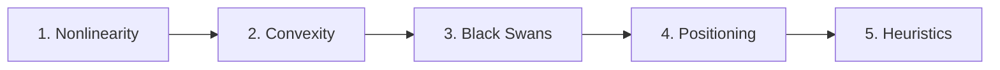
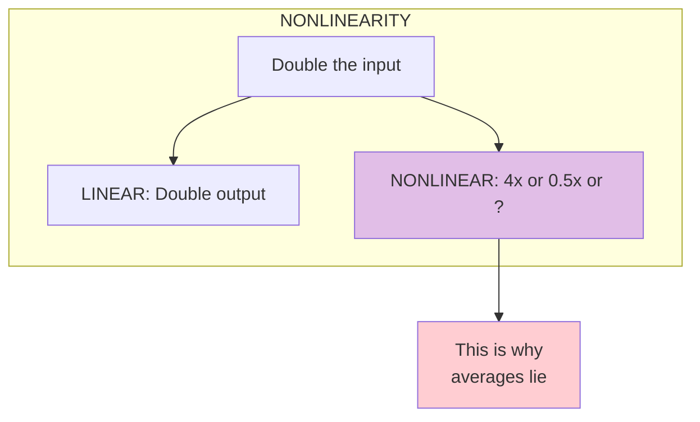
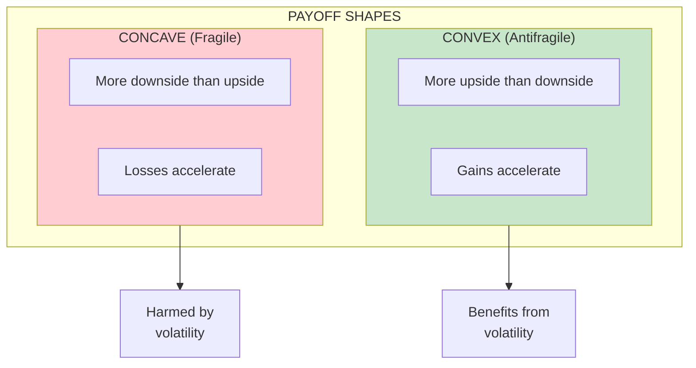
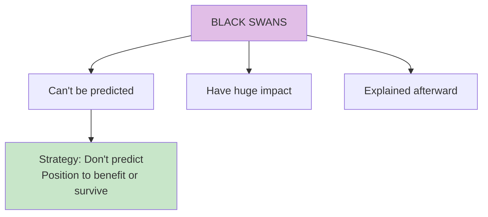
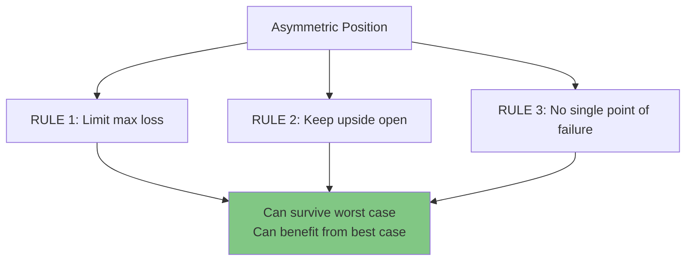
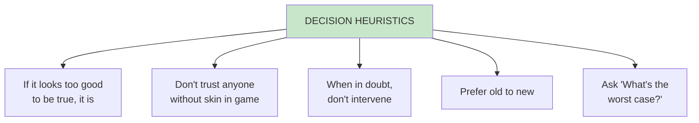
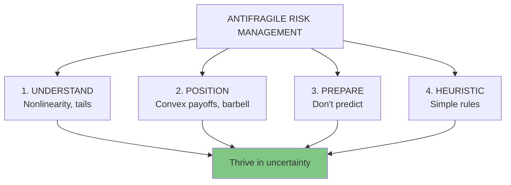

# Learning Path: Risk and Decision Making

This advanced path focuses on **risk management** and **decision making under uncertainty**—the mathematical and practical foundations of antifragility. Best for those interested in investing, business strategy, or risk management.

## Path Overview

---

## Step 1: Understanding Nonlinearity

**Goal:** Grasp why nonlinear effects matter for risk

### Read
- [Chapter 16: Lesson in Disorder](/chapters/book-5-nonlinear/ch16-lesson-disorder/)
- [Chapter 18: Stone and Pebbles](/chapters/book-5-nonlinear/ch18-stone-pebbles/)

### Key Diagram

### Check Your Understanding
- [ ] Can you explain nonlinearity?
- [ ] Do you understand why size creates fragility?
- [ ] Can you identify nonlinear relationships?

---

## Step 2: Convexity and Concavity

**Goal:** Understand the shapes that determine fragility

### Read
- [Chapter 16: Lesson in Disorder](/chapters/book-5-nonlinear/ch16-lesson-disorder/) (review)
- [Concept: Optionality](/concepts/optionality/)

### Key Diagram

### Check Your Understanding
- [ ] Can you draw a convex payoff curve?
- [ ] Do you understand Jensen's inequality (intuitively)?
- [ ] Can you identify convex vs concave positions?

---

## Step 3: Black Swans and Tail Risk

**Goal:** Understand extreme events and how to handle them

### Read
- [Chapter 4: What Kills Me](/chapters/book-1-antifragile-introduction/ch4-what-kills-me/)
- [Chapter 8: Prediction](/chapters/book-2-modernity/ch8-prediction/)
- [Concept: Skin in the Game](/concepts/skin-in-the-game/)

### Key Diagram

### Check Your Understanding
- [ ] Do you understand why prediction fails for Black Swans?
- [ ] Can you distinguish positive from negative Black Swans?
- [ ] Do you understand the Turkey Problem?

---

## Step 4: Asymmetric Positioning

**Goal:** Learn to structure positions with favorable payoffs

### Read
- [Concept: Barbell Strategy](/concepts/barbell-strategy/)
- [Chapter 12: Thales' Grapes](/chapters/book-4-optionality/ch12-thales-grapes/)
- [Chapter 10: Seneca](/chapters/book-3-nonpredictive/ch10-seneca/)

### Key Diagram

### Check Your Understanding
- [ ] Can you design a barbell position for any domain?
- [ ] Do you understand Seneca's approach to wealth?
- [ ] Can you identify asymmetric opportunities?

---

## Step 5: Practical Heuristics

**Goal:** Develop simple rules for antifragile decision making

### Read
- [Chapter 9: Fat Tony](/chapters/book-3-nonpredictive/ch9-fat-tony/)
- [Chapter 17: Tony vs Socrates](/chapters/book-5-nonlinear/ch17-tony-socrates/)
- [Chapter 7: Naive Intervention](/chapters/book-2-modernity/ch7-naive-intervention/)

### Key Diagram

### Check Your Understanding
- [ ] Do you have a personal set of decision heuristics?
- [ ] Can you apply Fat Tony's thinking?
- [ ] Do you know when NOT to intervene?

---

## Path Complete!

You now understand:
- ✅ Nonlinearity and why it matters
- ✅ Convexity and concavity in payoffs
- ✅ Black Swans and tail risk
- ✅ How to position asymmetrically
- ✅ Practical heuristics for decisions

**Advanced Reading:**
- *The Black Swan* by Nassim Nicholas Taleb
- *Fooled by Randomness* by Nassim Nicholas Taleb
- *Skin in the Game* by Nassim Nicholas Taleb

---

## Summary Framework

