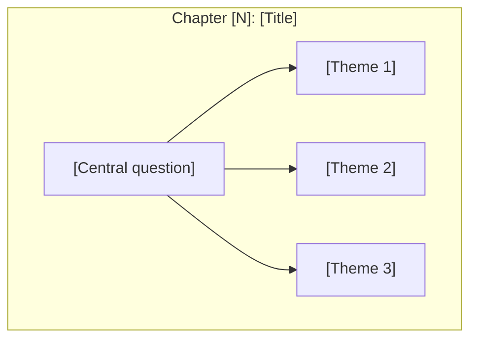

# Skill: Book to Visual Learning Companion

## Overview

This skill transforms a book into a comprehensive visual learning companion website featuring:
- Chapter-by-chapter visual diagrams
- Concept maps showing idea relationships
- Cross-linked concept pages
- Guided learning paths
- Full-text search
- Dark mode support

## Prerequisites

- Node.js 18+
- Book content (PDF, EPUB, or text)
- Claude Code with file read permissions

## Workflow

### Phase 1: Book Analysis

**Step 1.1: Extract Book Structure**

```
When given a book PDF or text:

1. IDENTIFY the book's structure:
   - Title and author
   - Number of chapters/parts
   - Chapter titles
   - Section/essay breakdown within chapters

2. CREATE a structure map:
   ```
   Book: [Title]
   Author: [Author]
   Parts: [Number]
   Chapters: [Number]

   Structure:
   - Part I: [Name]
     - Chapter 1: [Title]
       - 1.1 [Essay/Section]
       - 1.2 [Essay/Section]
     - Chapter 2: [Title]
   ...
   ```

3. IDENTIFY key concepts:
   - Central thesis/main idea
   - Key terms introduced
   - Recurring themes
   - Relationships between concepts
```

**Step 1.2: Concept Extraction**

```
For each chapter, identify:

1. CORE INSIGHT: The main idea in 1-2 sentences
2. KEY CONCEPTS: Terms or ideas introduced
3. RELATIONSHIPS: How concepts connect to:
   - Previous chapters
   - Other concepts in same chapter
   - Overall book thesis
4. VISUAL POTENTIAL: What diagrams would help:
   - Flowcharts for processes
   - Mindmaps for concept overviews
   - Hierarchies for structures
   - Comparisons for contrasts
   - Timelines for sequences
```

### Phase 2: Project Setup

**Step 2.1: Initialize Astro/Starlight Project**

```bash
# Create project directory
mkdir [book-slug]-visual
cd [book-slug]-visual

# Initialize Astro with Starlight
npm create astro@latest . -- --template starlight --yes --no-git

# Install dependencies
npm install

# Add Mermaid support
npm install astro-mermaid mermaid
```

**Step 2.2: Configure Project**

Create `astro.config.mjs`:

```javascript
// @ts-check
import { defineConfig } from 'astro/config';
import starlight from '@astrojs/starlight';
import astroMermaid from 'astro-mermaid';

export default defineConfig({
  integrations: [
    // Mermaid MUST come before Starlight
    astroMermaid({
      theme: 'default',
      autoTheme: true,
    }),
    starlight({
      title: '[Book Title] Visual',
      description: 'A visual learning companion for [Book Title]',
      sidebar: [
        // Will be populated based on book structure
      ],
      customCss: ['./src/styles/custom.css'],
    }),
  ],
});
```

**Step 2.3: Create Directory Structure**

```
src/content/docs/
├── index.mdx                 # Landing page
├── chapters/                 # Book chapters
│   ├── 01-[chapter-slug]/
│   │   ├── overview.md       # Chapter overview
│   │   └── [section].md      # Individual sections
│   └── 02-[chapter-slug]/
├── concepts/                 # Cross-chapter concepts
│   └── [concept].md
└── paths/                    # Guided learning paths
    └── [path-name].md
```

### Phase 3: Content Generation

**Step 3.1: Landing Page Template**

```markdown
---
title: [Book Title] Visual
description: A visual learning companion for [Book Title] by [Author]
template: splash
hero:
  tagline: Visual diagrams and concept maps for [Book Title]
  actions:
    - text: Start with Chapter 1
      link: /chapters/01-[slug]/overview/
      icon: right-arrow
      variant: primary
    - text: Explore Concepts
      link: /concepts/[main-concept]/
      variant: minimal
---

import { Card, CardGrid } from '@astrojs/starlight/components';

## How to Use This Companion

<CardGrid stagger>
  <Card title="By Chapter" icon="open-book">
    Follow the book's structure with visual explanations.
  </Card>
  <Card title="By Concept" icon="puzzle">
    Explore key concepts across chapters.
  </Card>
  <Card title="Guided Paths" icon="rocket">
    Follow curated learning sequences.
  </Card>
</CardGrid>

## The Big Idea

[2-3 sentences summarizing the book's main thesis]

```mermaid
flowchart LR
    [Simple diagram showing the book's central concept]
```
```

**Step 3.2: Chapter Overview Template**

```markdown
---
title: "Chapter [N]: [Title]"
description: "[Brief description]"
---

# Chapter [N]: [Title]

[1-2 paragraph introduction to chapter themes]

## Chapter Overview



## Sections in This Chapter

| Section | Title | Key Idea |
|---------|-------|----------|
| [N.1](/chapters/[slug]/[section]/) | [Title] | [One-line summary] |
| [N.2](/chapters/[slug]/[section]/) | [Title] | [One-line summary] |

## Key Themes

- **[Theme 1]** — [Brief explanation]
- **[Theme 2]** — [Brief explanation]

## Related Concepts

- [Concept 1](/concepts/[slug]/)
- [Concept 2](/concepts/[slug]/)
```

**Step 3.3: Section/Essay Template**

```markdown
---
title: "[N.M] [Section Title]"
description: "[Brief description for SEO]"
---

# [N.M] [Section Title]

> "[Quote from the book if available]"

## The Core Insight

[2-3 paragraphs explaining the main idea in accessible language]

## Visual: [Diagram Title]

[Brief explanation of what the diagram shows]

```mermaid
[Appropriate diagram type]
```

## [Additional sections as needed]

## Key Takeaways

1. **[Point 1]** — [Explanation]
2. **[Point 2]** — [Explanation]
3. **[Point 3]** — [Explanation]

## Think About It

- [Reflection question 1]
- [Reflection question 2]

## Related

- **Previous:** [Link to previous section]
- **Next:** [Link to next section]
- **Concept:** [Link to related concept page]
```

**Step 3.4: Concept Page Template**

```markdown
---
title: "[Concept Name]"
description: "Cross-chapter exploration of [concept]"
---

# [Concept Name]

[Definition and importance in 2-3 sentences]

## Concept Overview

```mermaid
mindmap
  root(([Concept]))
    [Branch 1]
      [Detail]
    [Branch 2]
      [Detail]
    [Branch 3]
      [Detail]
```

## [Main explanation sections]

## Where This Appears in the Book

| Chapter | Context | Key Insight |
|---------|---------|-------------|
| [Ch N](/chapters/...) | [Context] | [Insight] |

## Related Concepts

- [Concept 1](/concepts/[slug]/)
- [Concept 2](/concepts/[slug]/)
```

**Step 3.5: Learning Path Template**

```markdown
---
title: "Learning Path: [Name]"
description: "A guided journey through [topic]"
---

# Learning Path: [Name]

[Description of what this path covers and who it's for]

## Path Overview


---

## Step 1: [Title]

**Goal:** [What the reader will understand]

### Read
- [Link to content]

### Key Diagram

```mermaid
[Relevant diagram]
```

### Check Your Understanding
- [ ] [Question 1]
- [ ] [Question 2]

---

[Repeat for each step]

---

## Path Complete!

You now understand:
- ✅ [Learning outcome 1]
- ✅ [Learning outcome 2]

**Continue with:** [Next recommended content]
```

### Phase 4: Diagram Guidelines

**Step 4.1: Color Palette**

Use consistent colors throughout:

```
Agent/Basic unit:     #e3f2fd (light blue)
Agency/Group:         #fff3e0 (light orange)
Result/Outcome:       #e8f5e9 (light green)
Concept/Abstract:     #f3e5f5 (light purple)
Warning/Conflict:     #ffcdd2 (light red)
Highlight/Important:  #fff9c4 (light yellow)
```

**Step 4.2: Diagram Type Selection**

| Content Type | Mermaid Diagram | When to Use |
|--------------|-----------------|-------------|
| Process/Flow | `flowchart` | Steps, procedures, cause-effect |
| Concept overview | `mindmap` | Central idea with branches |
| Hierarchy | `flowchart TB` | Organization, levels |
| Timeline | `flowchart LR` | Sequences, evolution |
| Comparison | `flowchart` with subgraphs | Side-by-side concepts |
| State changes | `stateDiagram` | Before/after, transitions |
| Relationships | `graph` | Connections, networks |

**Step 4.3: Progressive Reveal Pattern**

For complex concepts, create multiple diagrams:

1. **Simple** — Single element
2. **Basic** — 2-3 elements connected
3. **Intermediate** — Small structured group
4. **Full** — Complete diagram

### Phase 5: Navigation Configuration

**Step 5.1: Sidebar Structure**

Organize by book structure with collapsible sections:

```javascript
sidebar: [
  {
    label: 'Start Here',
    items: [{ label: 'Welcome', slug: 'index' }],
  },
  {
    label: 'Part I: [Name]',
    collapsed: true,
    items: [
      {
        label: '[Chapter N]: [Title]',
        collapsed: true,
        items: [
          { label: 'Overview', slug: 'chapters/[slug]/overview' },
          { label: '[N.1] [Section]', slug: 'chapters/[slug]/[section]' },
        ],
      },
    ],
  },
  {
    label: 'Concepts',
    collapsed: true,
    items: [
      { label: '[Concept]', slug: 'concepts/[slug]' },
    ],
  },
  {
    label: 'Learning Paths',
    collapsed: true,
    items: [
      { label: '[Path Name]', slug: 'paths/[slug]' },
    ],
  },
],
```

### Phase 6: Build and Deploy

**Step 6.1: Local Testing**

```bash
# Development
npm run dev

# Production build
npm run build

# Preview production
npm run preview
```

**Step 6.2: Deployment Options**

```bash
# Vercel (recommended)
npx vercel

# Or build and deploy static files
npm run build
# Upload dist/ to any static host
```

## Example Execution

When user provides: "Create a visual companion for [Book Title]"

1. **Analyze**: Read the book/PDF, extract structure
2. **Plan**: Create chapter list, identify key concepts
3. **Setup**: Initialize Astro/Starlight project
4. **Generate**: Create content files with diagrams
5. **Configure**: Set up navigation
6. **Test**: Build and verify
7. **Deploy**: Start local server or deploy

## Best Practices

### Content
- Start with core insight, then details
- Use quotes from original when available
- Keep explanations accessible
- Include reflection questions
- Cross-link extensively

### Diagrams
- One main diagram per section minimum
- Use consistent colors
- Progressive reveal for complex topics
- Label clearly
- Keep diagrams focused (not too complex)

### Navigation
- Dual navigation: by chapter AND by concept
- Clear hierarchy
- Breadcrumbs through prev/next links
- Learning paths for guided experience

### Quality
- Every page should have at least one diagram
- All internal links should work
- Search should index all content
- Mobile-friendly (Starlight default)

## Troubleshooting

### Mermaid Not Rendering
- Ensure `astro-mermaid` comes BEFORE `starlight` in config
- Check diagram syntax
- Verify code block uses `mermaid` language

### Slug Not Found
- Starlight slugs don't include `/index`
- Use `chapters/01-slug/overview` not `chapters/01-slug/index`

### Build Fails
- Check all linked files exist
- Verify frontmatter YAML syntax
- Look for unclosed code blocks

## Output

The skill produces:
- Complete Astro/Starlight project
- All chapter content with diagrams
- Concept pages with cross-links
- Learning paths
- Search functionality
- Ready for deployment

## Metrics

A well-executed visual companion should have:
- 1+ diagram per section
- Bidirectional links between chapters and concepts
- At least 3 concept pages
- At least 1 learning path
- All pages with proper frontmatter
- Working search index
