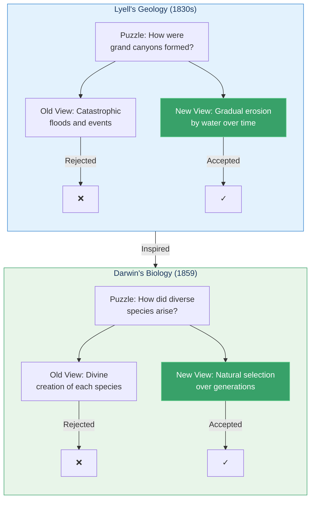
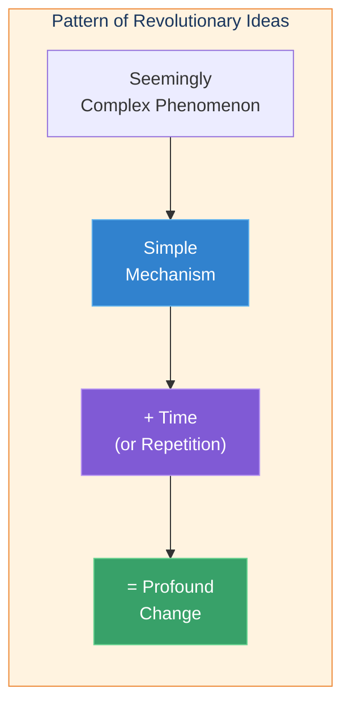
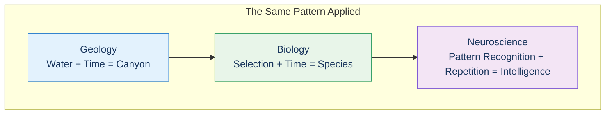

# Darwin & Lyell: A Metaphor from Geology

> "Darwin simply discovered the role of selection, a kind of causality very different from the push-pull mechanisms of science up to that time."
> — B. F. Skinner

## The Core Insight

In the early 19th century, geologist Charles Lyell proposed a radical idea: the Grand Canyon and other massive geological formations weren't created by catastrophic events, but by the gradual action of water over millions of years—essentially one grain of rock at a time.

This insight directly inspired Charles Darwin. If water could carve a canyon grain by grain, perhaps small variations in organisms could accumulate generation by generation to produce the incredible diversity of life.

## Visual: From Geology to Biology

## The Pattern of Discovery

### Examples of This Pattern

| Domain | Complex Phenomenon | Simple Mechanism | Time Factor |
|--------|-------------------|------------------|-------------|
| Geology | Grand Canyon | Water erosion | Millions of years |
| Biology | Species diversity | Variation + Selection | Millions of generations |
| Brain | Human intelligence | Pattern recognition | Hundreds of millions of modules |

## Key Takeaways

1. **Resistance to simplicity** — Scientists initially ridiculed Lyell's thesis; complexity seemed to require complex causes
2. **Unification through elegance** — Darwin's theory brought coherence to countless observations about life
3. **Simple algorithms, repeated** — This pattern—simple processes creating complex outcomes through repetition—is exactly what Kurzweil sees in the neocortex

## The Bridge to the Brain

Kurzweil draws a direct parallel: Just as water carved canyons grain by grain, and evolution created species generation by generation, the neocortex creates intelligence through millions of simple pattern recognizers working together.

## Think About It

- Why do we instinctively expect complex outcomes to have complex causes?
- What other fields might benefit from seeking simple, repeated mechanisms?
- How does this pattern apply to learning and skill development?

## Related

- **Previous:** [Chapter Overview](/chapters/01-thought-experiments-world/overview/)
- **Next:** [Einstein's Mind Experiments](/chapters/01-thought-experiments-world/einstein/)
- **Concept:** [Hierarchical Learning](/concepts/hierarchical-learning/)
