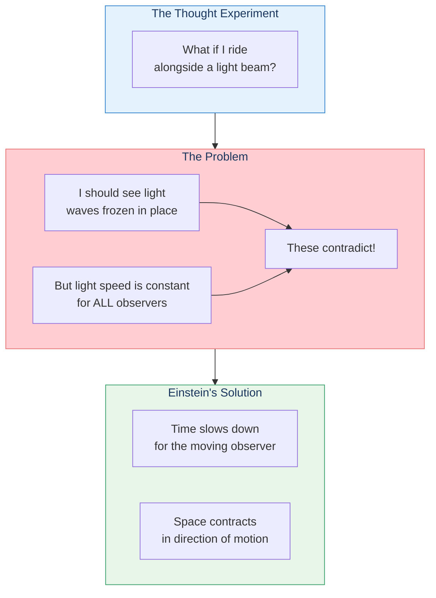
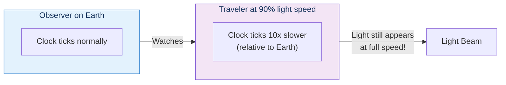
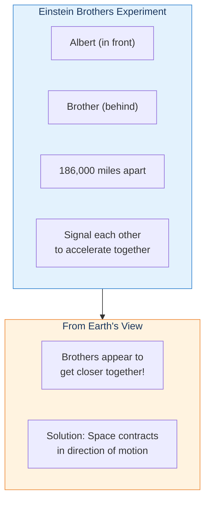
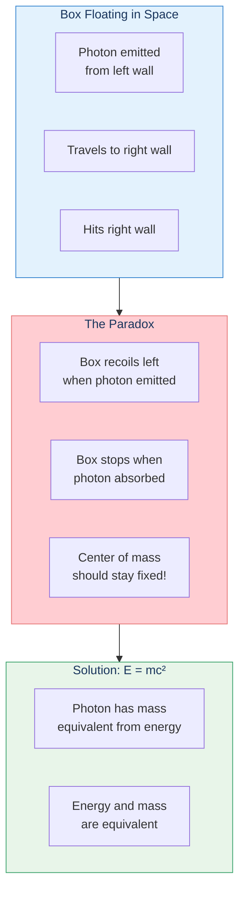
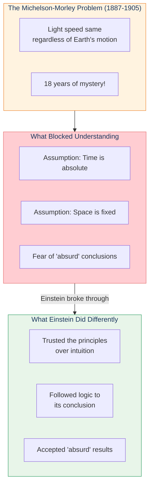
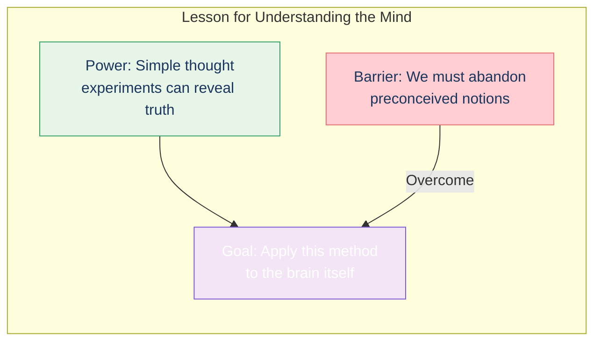

# Einstein's Mind Experiments

> "Nothing is at last sacred but the integrity of your own mind."
> — Ralph Waldo Emerson

## The Core Insight

At sixteen, Albert Einstein daydreamed about riding alongside a beam of light. This simple thought experiment—requiring no laboratory equipment—led to the most profound revolution in physics since Newton.

## Riding the Light Beam

## The Three Key Experiments

### 1. Time Dilation

### 2. Length Contraction

### 3. Mass-Energy Equivalence

## Why Others Couldn't See It

## The Lesson for Understanding the Mind

Kurzweil emphasizes two lessons from Einstein's success:

1. **The extraordinary power of human thought** — Without any equipment, a teenager revolutionized physics
2. **The common failure of thinking** — Most people couldn't abandon their preconceptions, even when evidence demanded it

## Key Takeaways

1. **Simple experiments, profound results** — No laboratory needed, just careful thinking
2. **Follow principles to conclusions** — Even when they seem absurd
3. **Break assumptions** — Time isn't absolute; maybe the brain isn't as complex as it seems
4. **The brain is accessible** — We experience thinking directly, making it ideal for self-reflection

## Think About It

- What assumptions about consciousness or intelligence might we need to abandon?
- Why is it so hard to follow logic to conclusions that violate our intuitions?
- How might the "simple algorithm, repeated" pattern apply to the mind?

## Related

- **Previous:** [Darwin & Lyell](/chapters/01-thought-experiments-world/darwin-lyell/)
- **Next:** [Chapter 2: Thought Experiments on Thinking](/chapters/02-thought-experiments-thinking/overview/)
- **Concept:** [Pattern Recognition Theory](/concepts/prtm/)
