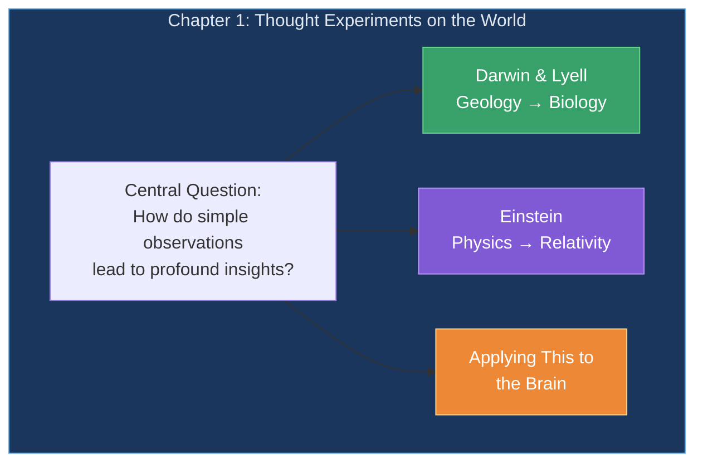
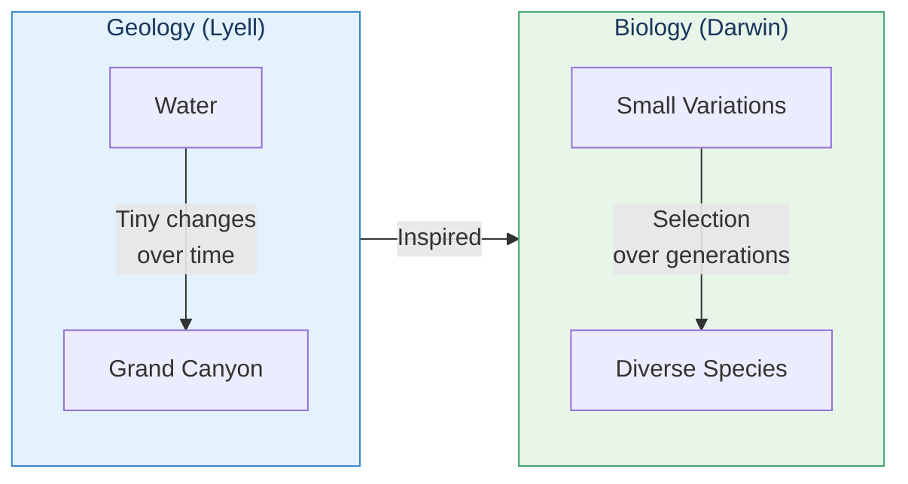
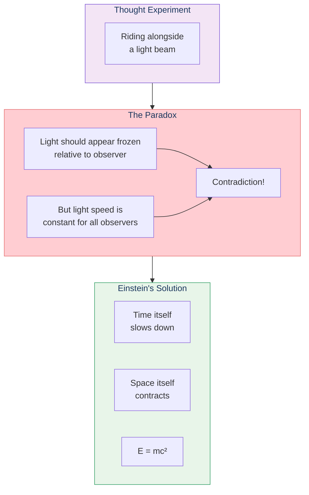
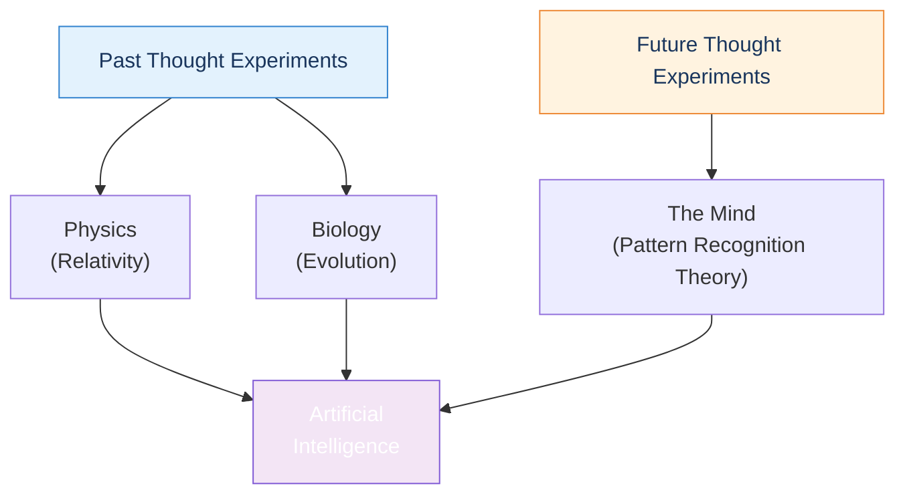

# Chapter 1: Thought Experiments on the World

Kurzweil opens by celebrating the power of human thought through history's most transformative mind experiments—from Darwin's theory of evolution to Einstein's relativity. These examples set the stage for applying the same approach to understanding the mind itself.

## Chapter Overview

## The Power of Thought Experiments

> "If a young man's idle thoughts and the use of no equipment other than pen and paper were sufficient to revolutionize our understanding of physics, then we should be able to make reasonable progress with a phenomenon with which we are much more familiar."

Kurzweil makes a profound point: We experience our own thinking every moment of our lives, making the mind the most accessible subject for thought experiments.

## Sections in This Chapter

| Section | Title | Key Idea |
|---------|-------|----------|
| 1.1 | [A Metaphor from Geology](/chapters/01-thought-experiments-world/darwin-lyell/) | Lyell's gradual geological change inspired Darwin |
| 1.2 | [Riding on a Light Beam](/chapters/01-thought-experiments-world/einstein/) | Einstein's thought experiments revolutionized physics |
| 1.3 | A Unified Model | Applying mind experiments to the brain |

## Key Themes

### The Lyell-Darwin Connection

- **Gradual Change**: Both Lyell and Darwin showed how tiny, incremental changes compound over time to produce dramatic results
- **Simple Mechanisms**: Complex outcomes (canyons, species) emerge from simple, repeated processes
- **Pattern of Discovery**: Elegant theories unify previously disconnected observations

### Einstein's Revolutionary Insights

- **Following Principles to Conclusions**: Einstein stuck with established principles even when they led to "absurd" conclusions
- **Breaking Assumptions**: Most thinkers couldn't abandon preconceived notions about time and space
- **Simple Math, Profound Impact**: Relatively simple equations described revolutionary concepts

## The Brain Awaits

Kurzweil sets up the central argument of the book: If thought experiments could unlock physics and biology, they can unlock the secrets of the mind. And we have an advantage—we experience our own thinking directly, every moment of our lives.

## Key Takeaways

1. **Simple principles create complex outcomes** — Water carved the Grand Canyon; variation and selection created all species; a simple neocortical algorithm creates all human thought
2. **Thought experiments are powerful tools** — No lab equipment needed to revolutionize understanding
3. **Follow principles to their conclusions** — Even when they seem absurd at first
4. **The mind is accessible** — We experience it directly, making it ideal for self-reflection

## Think About It

- What assumptions about the mind might we need to abandon, as Einstein abandoned assumptions about time and space?
- If the brain uses a simple, repeated algorithm, why does it seem so complex?
- How might gradual learning over a lifetime parallel evolutionary change over millennia?

## Related

- **Next:** [Chapter 2: Thought Experiments on Thinking](/chapters/02-thought-experiments-thinking/overview/)
- **Concept:** [Pattern Recognition Theory](/concepts/prtm/)
- **Path:** [Quick Overview](/paths/quick-overview/)
