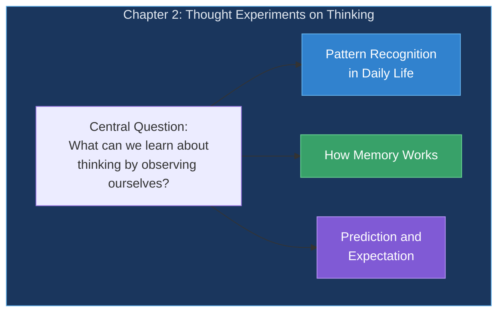
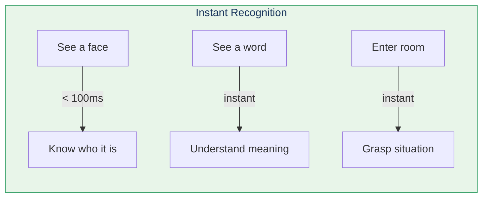
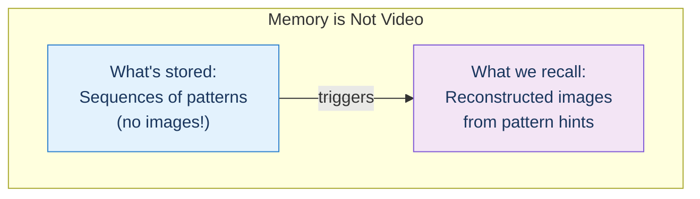
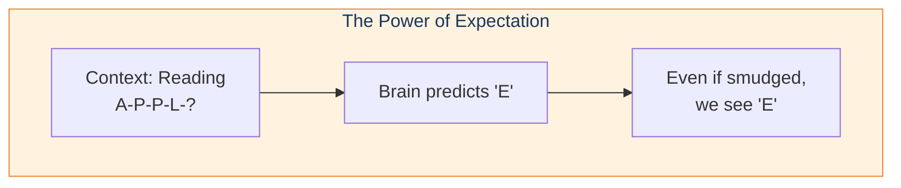
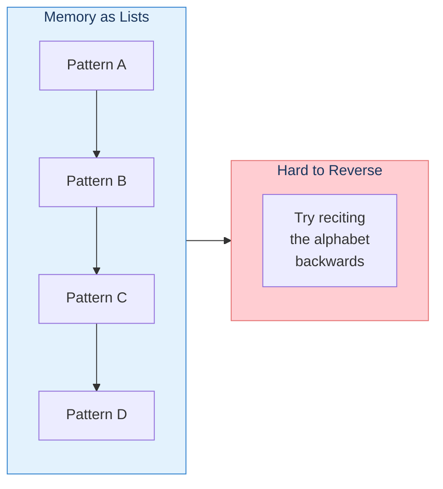
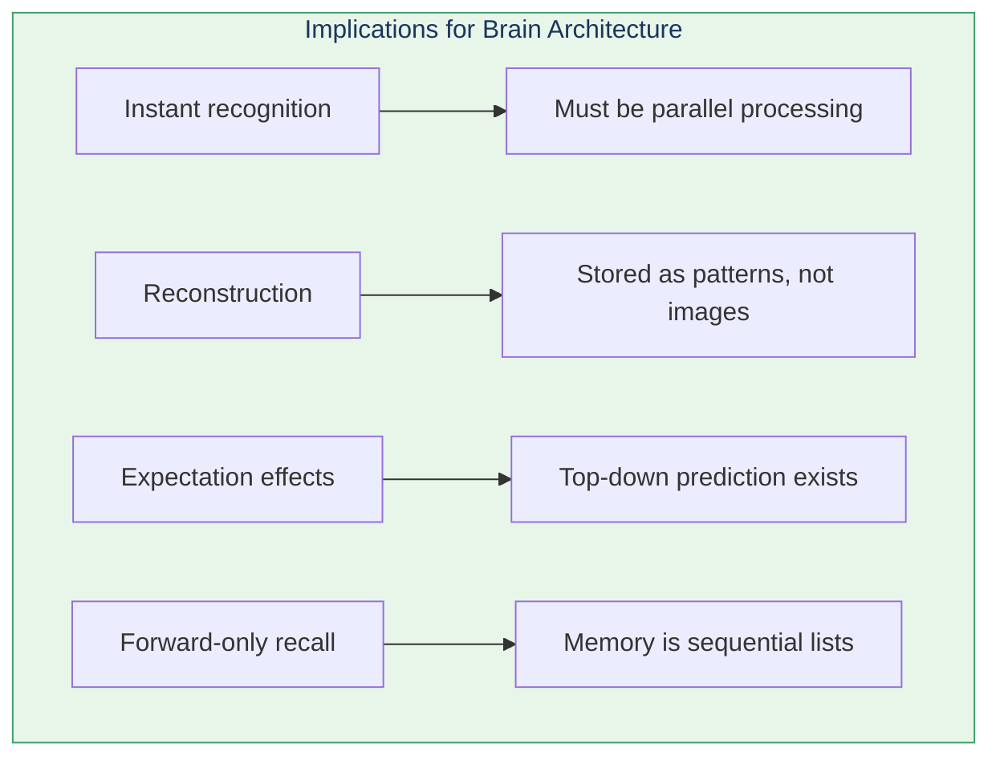

# Chapter 2: Thought Experiments on Thinking

> "I think, therefore I am." — René Descartes

Now Kurzweil turns the lens inward, using thought experiments to examine how we ourselves think, perceive, and remember.

## Chapter Overview

## Key Observations

### 1. We Recognize Patterns Instantly

We don't consciously analyze features—recognition just *happens*.

### 2. Memory is Reconstruction

Memories aren't stored as videos or images. We reconstruct scenes from pattern sequences each time we remember.

### 3. Expectation Shapes Perception

We see what we expect to see:

This is demonstrated by our ability to read scrambled text:

> "Aoccdrnig to rscheearch at Cmabrigde Uinervtisy..."

### 4. Memories are Lists

We can only recall memories in one direction (forward):

## What These Observations Tell Us

These everyday observations constrain what the brain's architecture must be—leading directly to the Pattern Recognition Theory of Mind.

## Key Takeaways

1. **Pattern recognition is fast and automatic** — Suggests parallel processing
2. **Memory is reconstructive** — Patterns, not recordings
3. **Prediction shapes perception** — Top-down information flow
4. **Sequential recall** — Memory stored as ordered lists
5. **Self-observation reveals structure** — Mind experiments work!

## Think About It

- Why can you recognize a friend instantly but struggle to describe them?
- Why do eyewitness testimonies vary so much for the same event?
- What does the difficulty of backward recall tell us about memory structure?

## Related

- **Previous:** [Chapter 1: Thought Experiments on the World](/chapters/01-thought-experiments-world/overview/)
- **Next:** [Chapter 3: Pattern Recognition Theory](/chapters/03-pattern-recognition-theory/overview/)
- **Concept:** [Pattern Recognition Theory](/concepts/prtm/)
