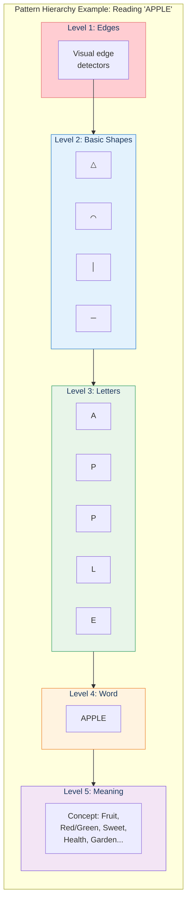
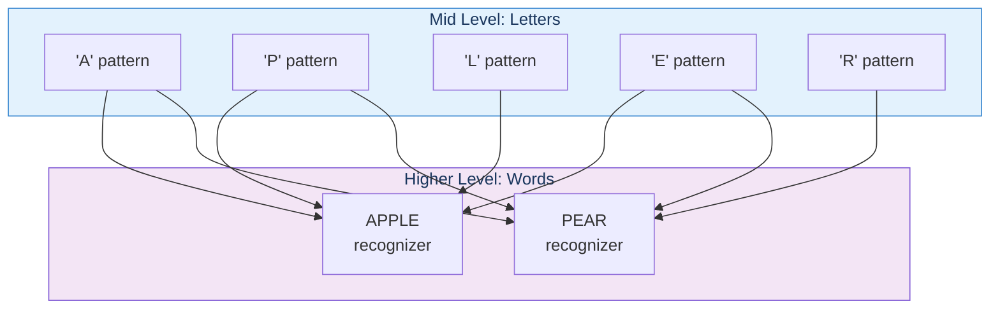
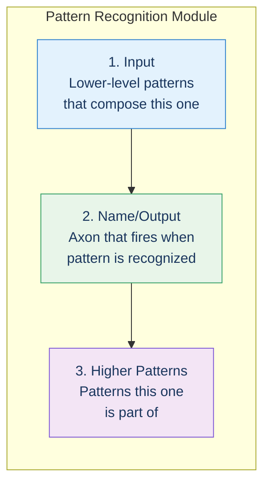
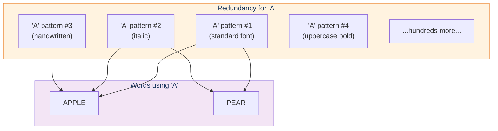
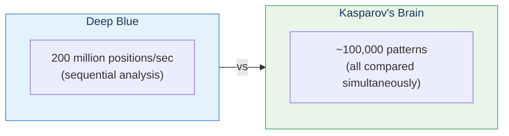

# Hierarchy of Patterns

> "Human beings have only a weak ability to process logic, but a very deep core capability of recognizing patterns."

## The Core Insight

Every pattern in the neocortex is composed of lower-level patterns. A word is made of letters; letters are made of shapes; shapes are made of edges. This hierarchy extends all the way from raw sensory data up to abstract concepts like "irony" and "justice."

## Visual: The Pattern Hierarchy

## How Pattern Recognizers Connect

Each pattern recognizer:
- Receives input from **lower-level** recognizers
- Sends output to **higher-level** recognizers
- Uses "web links" (axons and dendrites) to connect

**Key insight**: The letter "A" pattern doesn't repeat its description for every word that uses it. Instead, "APPLE" and "PEAR" both link to the same "A" pattern, like hyperlinks on the web.

## The Three Parts of Every Pattern

Each pattern recognition module has three components:

### 1. Input: Lower-Level Patterns

- Dendrites receive signals from lower-level recognizers
- Not all inputs need to fire for recognition
- Each input has an "importance weight"

### 2. Name: Recognition Signal

- When the module recognizes its pattern, it fires its axon
- This is the pattern's "name" in brain language
- Signal says: "Hey, I just saw [my pattern]!"

### 3. Output: Higher-Level Patterns

- Axon connects to many higher-level recognizers
- Tells them: "Part of your pattern might be present"

## Redundancy: Multiple Copies

We don't have just one pattern for important things—we have many:

This redundancy allows us to:
- Recognize patterns from different angles and perspectives
- Handle variations (fonts, handwriting, accents)
- Maintain function even if some recognizers fail

## Example: Reading Speed

Kurzweil explains how Garry Kasparov, the chess grandmaster, could compete with IBM's Deep Blue despite analyzing less than one board position per second (versus Deep Blue's 200 million).

**The answer**: Kasparov had ~100,000 chess patterns stored in his neocortex, and he compared them **all simultaneously**.

This parallel pattern matching is why we can:
- Instantly recognize faces
- Understand spoken language in real-time
- Navigate complex environments effortlessly

## Key Takeaways

1. **Everything is hierarchical** — From edges to abstract concepts
2. **Patterns reference patterns** — Like hyperlinks, not copies
3. **Redundancy enables robustness** — Multiple versions of important patterns
4. **Parallel processing** — All 300 million recognizers work simultaneously
5. **~100,000 chunks of expertise** — The size of human expert knowledge

## Think About It

- How many levels of hierarchy might exist between raw pixels and "irony"?
- Why would the brain use redundancy instead of single, perfect templates?
- How does parallel processing change what's computationally feasible?

## Related

- **Previous:** [Chapter 3 Overview](/chapters/03-pattern-recognition-theory/overview/)
- **Next:** [Pattern Recognizers](/chapters/03-pattern-recognition-theory/recognizers/)
- **Concept:** [Hierarchical Learning](/concepts/hierarchical-learning/)
